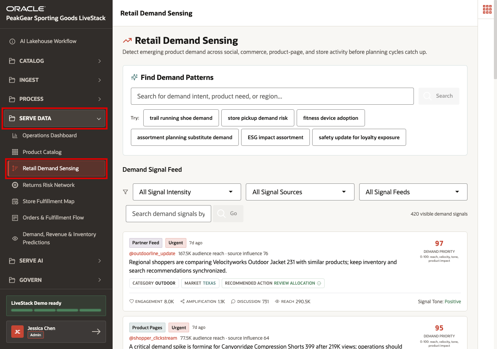
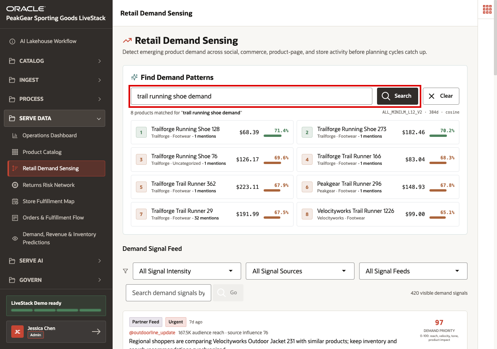
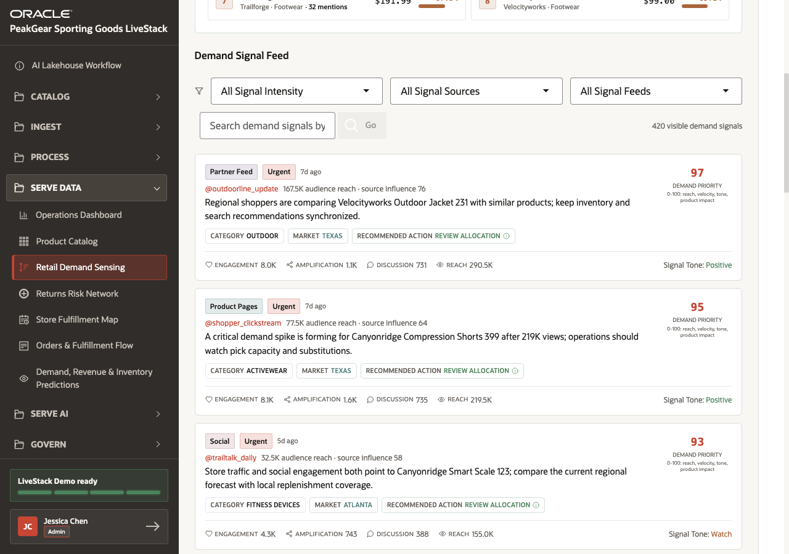
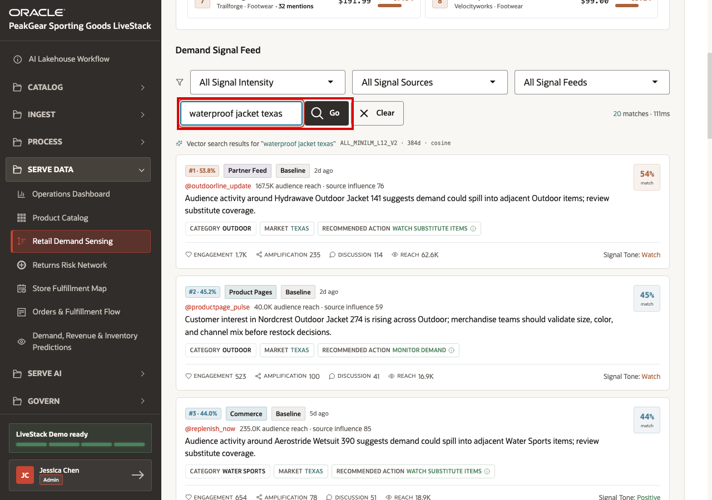

# Scene 9 Retail Demand Sensing

## Introduction

**PeakGear** has already captured source data into the **AI Lakehouse** and transformed it through the medallion process. Demand sensing is where prepared data becomes an early-warning view for planners and merchandisers.

The business challenge is timing. Retail demand can shift before traditional planning reports catch up. A product can trend because of social activity, product-page traffic, commerce behavior, store activity, or partner feeds. If those signals remain disconnected, PeakGear may react too late: inventory is not moved, campaigns miss the moment, substitutes are not prepared, and fulfillment teams only see pressure after customers are already affected.

**Retail Demand Sensing** shows the **Serve Data** outcome of the AI Lakehouse. Semantic search means matching by meaning, not only by exact words, so users can find related products and signals even when the wording differs.

Estimated Time: **10 minutes**

### Objectives

In this scene, you will:

- Open **Retail Demand Sensing** from the **Serve Data** menu.
- Search demand patterns by business intent.
- Review demand signal cards and filters.
- Search demand signals semantically by product need and market.
- Connect demand sensing to Gold-layer Serve Data outcomes.

## Task 1: Open Retail Demand Sensing



Perform the following set of steps to open **Retail Demand Sensing**:

1. In the left sidebar, expand **Serve Data**.
2. Select **Retail Demand Sensing**.
3. Confirm that the page title is **Retail Demand Sensing**.

This page is a Serve Data experience. The user is no longer ingesting or transforming raw events. They are using the demand intelligence that the AI Lakehouse has already prepared.

## Task 2: Search by demand intent



Perform the following set of steps to search by demand intent:

1. In **Find Demand Patterns**, enter:

```text
trail running shoe demand
```

2. Click **Search**.
3. Review the ranked products returned by the search.
4. Review the product names, categories, mention counts, and match scores.

This search is semantic. The user describes the business intent rather than typing an exact SKU or product name. The Gold-layer product and demand data can be searched by meaning because the medallion process has already standardized the product catalog and connected demand signals to products.

## Task 3: Review the demand signal feed



Perform the following set of steps to review the demand signal feed:

1. Review the **Demand Signal Feed**.
2. Review the filters for **Signal Intensity**, **Signal Sources**, and **Signal Feeds**.
3. Review the first demand signal cards.
4. Look for the business fields on each card: **Category**, **Market**, **Recommended Action**, **Demand Priority**, **Reach**, and **Signal Tone**.

The feed translates source activity into business-readable demand intelligence. A merchandiser or operations user does not need to inspect the original event stream. The served view already connects the signal to products, markets, priority, reach, and action guidance.

## Task 4: Search demand signals by intent



Perform the following set of steps to search demand signals by intent:

1. In the feed search field, enter:

```text
waterproof jacket texas
```

2. Click **Go**.
3. Review the returned signal cards and their match percentages.
4. Review how the results include related outdoor products, Texas market signals, recommended actions, reach, and signal tone.

This second search shows semantic search over the demand signals themselves. The user can ask for a market condition or customer need and find relevant signals even when the exact words do not match perfectly. That is valuable because demand often appears in messy language across many source systems.

## Conclusion: Business Outcome

Retail Demand Sensing shows how PeakGear can move from passive reporting to active demand awareness. Instead of waiting for the next planning cycle, business users can search emerging demand by intent, inspect the signals behind that demand, and understand which products or markets need attention.

The medallion process is what makes this reliable. Bronze captures raw source activity, Silver standardizes and enriches signals, and Gold serves consistent product and demand data that semantic search can rank and explain. Without that foundation, PeakGear would be searching disconnected event streams and inconsistent product references.

For the business, this means merchandisers and operations teams can identify demand surges earlier, prepare substitute products, adjust allocation, and coordinate fulfillment before customer experience is affected.

You can move to the next scene.

## Credits & Build Notes
- **Author** - Oracle LiveLabs Team
- **Last Updated By/Date** - Oracle LiveLabs Team, 2026-06-12
