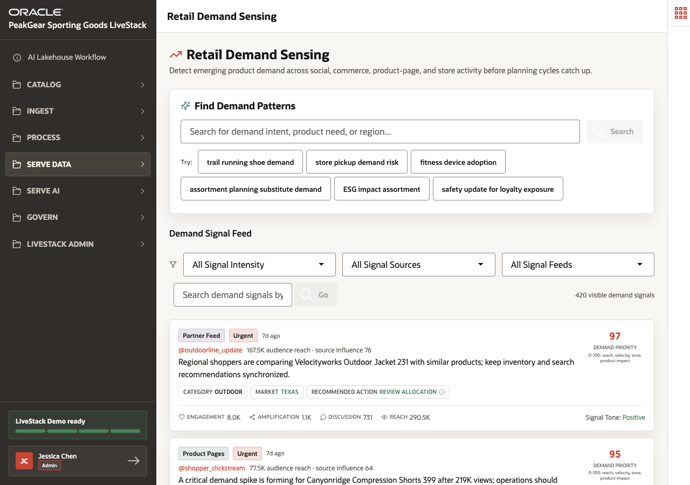

# Scene 7 Retail Demand Sensing

## Introduction

Merchandisers need to see demand patterns before the next planning cycle. Social, product-page, commerce, store, and partner signals can reveal whether a product is trending in a specific category or region.

This scene shows how **Retail Demand Sensing** turns source signals into business-readable demand intelligence.

Estimated Time: **10 minutes**

### Objectives

In this scene, you will:

- Review demand signals by intensity, source, account, category, and region.
- Search for demand patterns with business language.
- Interpret demand priority, signal tone, reach, and recommended action.
- Connect streaming Bronze events to later merchandising and fulfillment decisions.

## Task 1: Review the demand signal feed

1. Open **Serve Data** and select **Retail Demand Sensing**.
2. Review the feed title and filters for signal intensity and signal sources.
3. Use examples such as **Velocityworks Outdoor Jacket 231** in **TX** with **290,496 views** or **Canyonridge Compression Shorts 399** with **219,468 views**.
4. Explain that the page translates source activity into retail terms such as **Demand Priority**, **Signal Tone**, **Reach**, and **Recommended action**.

## Task 2: Search for demand patterns

1. Use **Find Demand Patterns** to search for a product need, intent, or region.
2. Review the returned cards and their category and region chips.
3. Hover over a recommended action indicator to explain why that action was suggested.
4. Connect the result back to the streaming story: raw signals land in Bronze, then downstream processing and analytics make them usable by merchandisers.

You can move to the next scene.

## Credits & Build Notes
- **Author** - Oracle LiveLabs Team
- **Last Updated By/Date** - Oracle LiveLabs Team, 2026-06-05
