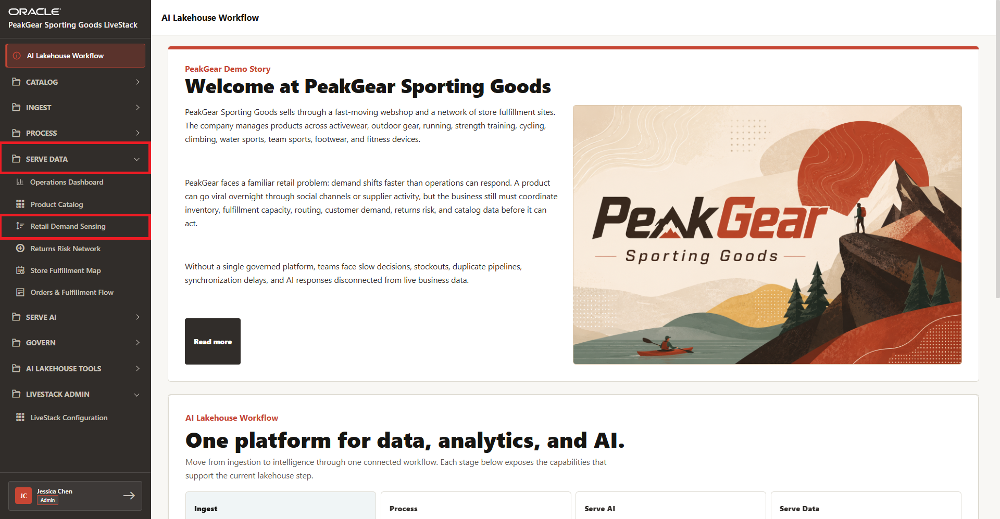
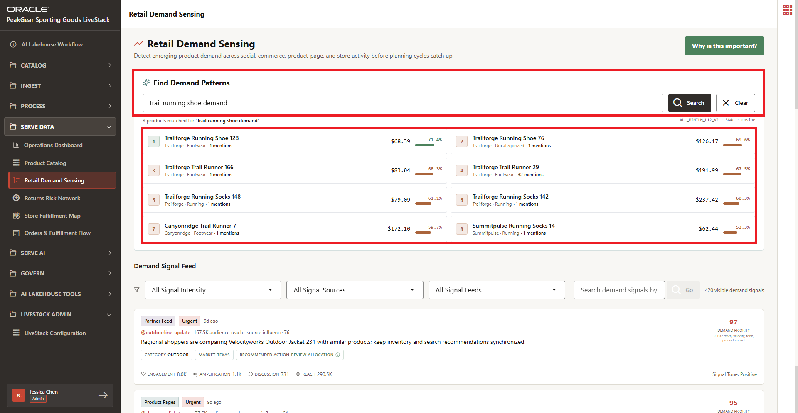
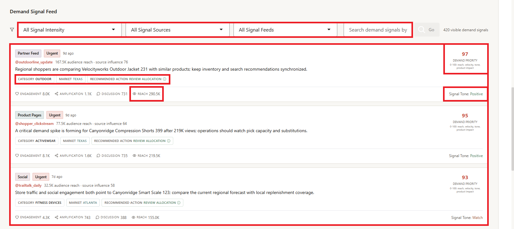
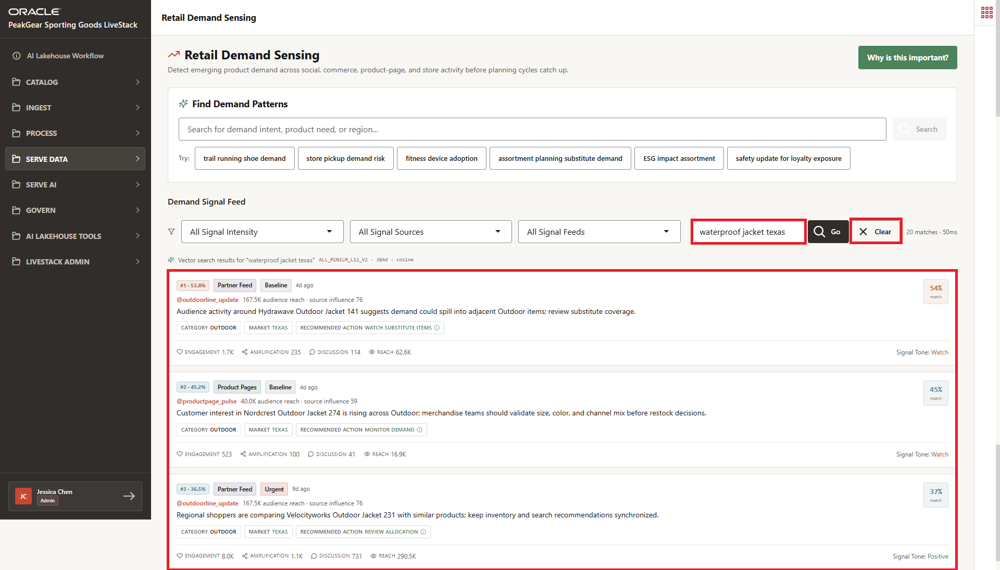

# Retail Demand Sensing

## Introduction

**PeakGear** has captured source data in the **AI Lakehouse** and processed it through the medallion process. Demand sensing gives planners and merchandisers an early view of changing demand.

Retail demand can shift before planning reports catch up. Signals from social activity, product pages, commerce, stores, and partners can show where demand is changing. If those signals stay separate, PeakGear may move inventory or prepare substitutes too late.

**Retail Demand Sensing** shows a **Serve Data** outcome of the AI Lakehouse. Semantic search matches by meaning as well as exact words, so users can find related products and signals when the wording differs.

**Oracle AI Vector Search** supports this search with embeddings for products and demand signals.

Estimated Time: **10 minutes**

### Objectives

In this scene, you will:

- Search for demand patterns by business intent.
- Review demand signals, filters, and related products.
- Search signals by product need and market.
- See how prepared demand data supports planning.

## Task 1: Open Retail Demand Sensing



Open **Retail Demand Sensing**:

1. In the left sidebar, expand **Serve Data**.
2. Select **Retail Demand Sensing**.
3. Confirm that the page title is **Retail Demand Sensing**.

This page is a Serve Data experience. It uses demand data that the AI Lakehouse has already prepared.

## Task 2: Search by demand intent



Search by demand intent:

1. In **Find Demand Patterns**, enter:

    ```text
    trail running shoe demand
    ```

2. Click **Search**.
3. Review the ranked products returned by the search.
4. Review the product names, categories, mention counts, and match scores.

This search uses meaning rather than an exact SKU or product name. The medallion process connects standardized product data with demand signals so users can search both by intent.

## Task 3: Review the demand signal feed



Review the demand signal feed:

1. Review the **Demand Signal Feed**.
2. Review the filters for **Signal Intensity**, **Signal Sources**, and **Signal Feeds**.
3. Review the first demand signal cards.
4. Look for the business fields on each card: **Category**, **Market**, **Recommended Action**, **Demand Priority**, **Reach**, and **Signal Tone**.

The feed turns source activity into demand context. A merchandiser or operations user can review the signal with its products, markets, priority, reach, and recommended action without inspecting the original event stream.

## Task 4: Search demand signals by intent



Search demand signals by intent:

1. In the feed search field, enter:

    ```text
    waterproof jacket texas
    ```

2. Click **Go**.
3. Review the returned signal cards and their match percentages.
4. Review how the results include related outdoor products, Texas market signals, recommended actions, reach, and signal tone.

This search applies semantic search to the demand signals themselves. Users can ask for a market condition or customer need and find related signals even when the exact words differ.

## Conclusion: Business Outcome

Retail Demand Sensing shows how PeakGear can see changing demand before the next planning cycle. Business users can search by intent, inspect the signals behind the demand, and see which products or markets need attention.

Bronze captures source activity, Silver standardizes and enriches signals, and Gold provides product and demand data that semantic search can rank. This keeps the search connected to consistent product references.

For the business, merchandisers and operations teams can identify demand changes earlier, prepare substitute products, adjust allocation, and coordinate fulfillment.


## Acknowledgements

* **Author** - Kevin Lazarz August 2026
* **Contributor** - Eugenio Galiano
* **Last Updated By/Date** - Kevin Lazarz  August 2026
