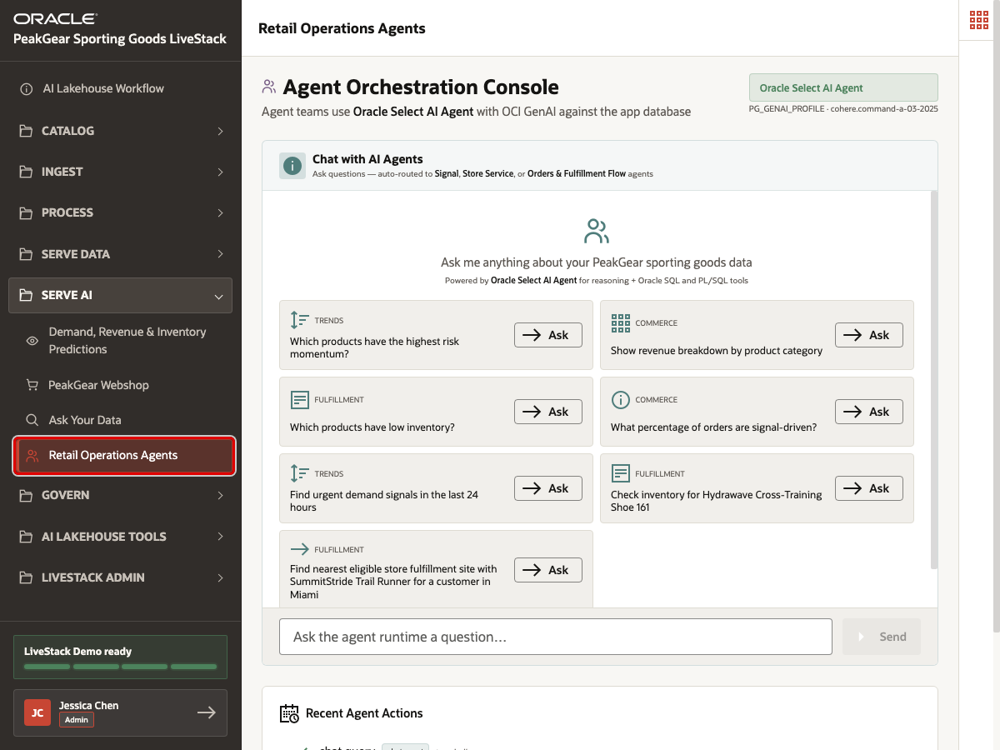
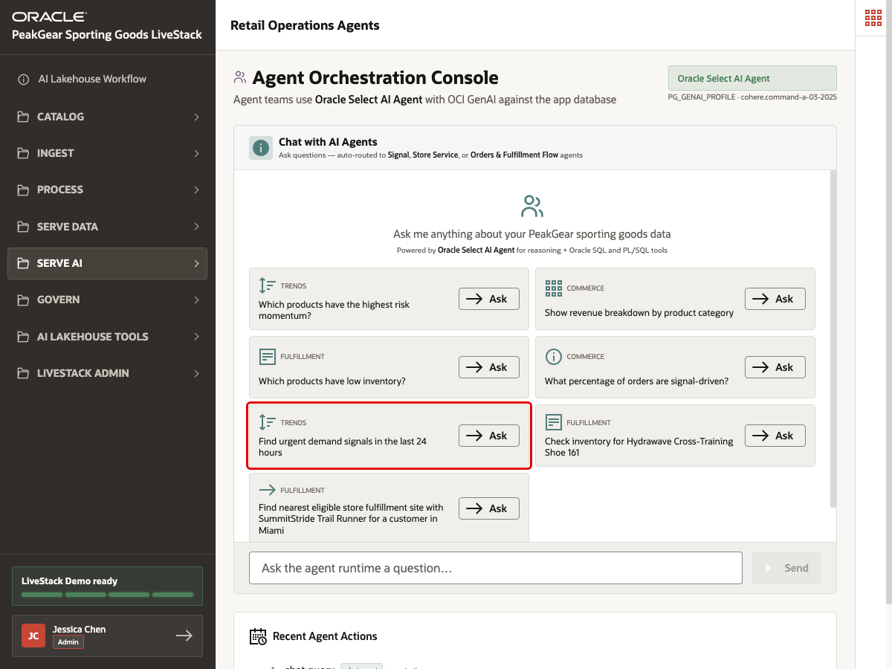
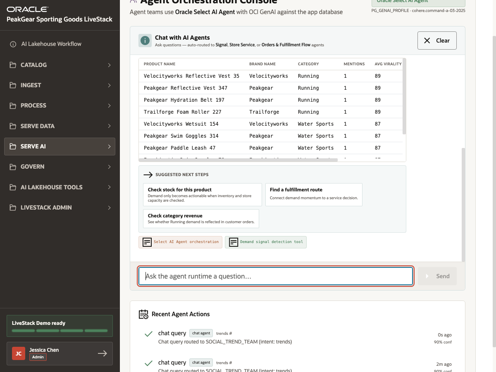
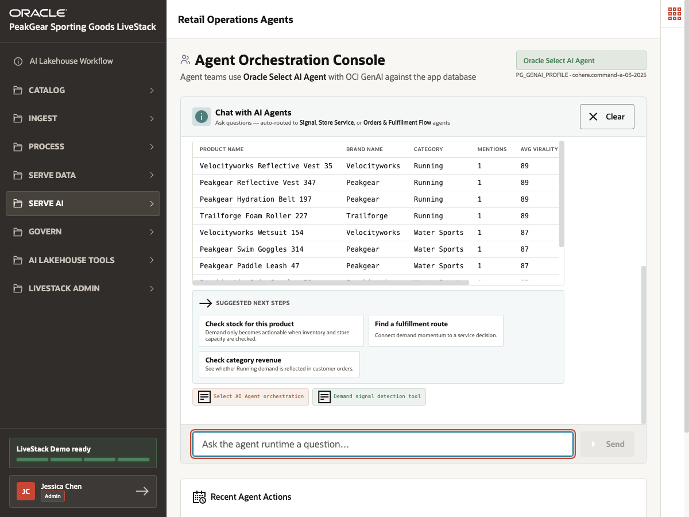

# Scene 16 Retail Operations Agents

## Introduction

PeakGear does not only need answers. Operational teams need coordinated actions. A demand spike may require inventory checks, fulfillment routing, category revenue review, and follow-up decisions. Without an agent workflow grounded in governed data, teams may copy facts across tools, miss the next best action, or rely on recommendations that cannot be audited.

**Retail Operations Agents** demonstrates a Serve AI outcome. An agent is a guided AI workflow that can use approved tools and data to suggest next steps.

This is not just an application chatbot. The runtime profile, agent teams, SQL tools, and PL/SQL tools are the controlled backend pieces that keep the agent grounded in the LiveStack environment.

The business outcome is faster operational response. Instead of treating AI as a generic chat window, PeakGear can route questions to specialized Oracle AI Database agent teams that use governed data, SQL and PL/SQL tools, and auditable action history.

Estimated Time: **10 minutes**

### Objectives

In this scene, you will:

- Open **Retail Operations Agents** from the **Serve AI** menu.
- Confirm that the page is using **Oracle Select AI Agent**.
- Review the available agent question options.
- Ask for urgent demand signals from the last 24 hours.
- Review the agent response, suggested next steps, and tool evidence.
- Connect operational agents to the AI Lakehouse medallion process.

## Task 1: Open Retail Operations Agents



Perform the following set of steps to open Retail Operations Agents:

1. In the left sidebar, expand **Serve AI**.
2. Select **Retail Operations Agents**.
3. Confirm that the page title is **Agent Orchestration Console**.
4. Confirm that the runtime indicator shows **Oracle Select AI Agent**.

This page represents the action side of Serve AI. The user is no longer browsing a dashboard or a catalog; they are asking Oracle AI Database Select AI Agent teams to interpret live operational context and return a business recommendation.

## Task 2: Review the agent question options



Perform the following set of steps to review the agent question options:

1. Review the example question tiles.
2. Notice that the questions map to different operational domains, including demand signals, fulfillment, commerce, inventory, and route planning.
3. Focus on the **Find urgent demand signals in the last 24 hours** question.

The example questions show the intended operating model: users ask in business language, and the application routes the question to the right Select AI Agent team. In the demo configuration, the agent teams are created in Oracle AI Database with `DBMS_CLOUD_AI_AGENT` and use registered tools rather than arbitrary ad hoc prompts.

## Task 3: Ask for urgent demand signals



Perform the following set of steps to ask for urgent demand signals:

1. Click **Ask** for:

```text
Find urgent demand signals in the last 24 hours
```

2. Wait for the response.
3. Review the ranked products and signal metrics.
4. Review the **Suggested next steps**, such as checking stock, finding a fulfillment route, or checking category revenue.
5. Review the tool indicators below the response.

This task shows how Select AI Agent orchestration can turn a demand question into a workflow. The response does not stop at "here are products with signal momentum." It also gives next actions that connect demand sensing to inventory, fulfillment, and commerce decisions.

If the native Select AI Agent team call takes longer than the demo timeout, the UI may answer through the same registered Oracle SQL and PL/SQL tools. This fallback still demonstrates the governed tool pattern, so treat it as a supported demo path rather than a failed run.

## Task 4: Review recent agent actions



Perform the following set of steps to review recent agent actions:

1. Scroll to **Recent Agent Actions**.
2. Review the action records created by recent agent interactions.
3. Explain that agent workflows should be traceable, not just conversational.

The recent actions area reinforces the governance point. Operational AI needs durable records of what was asked, which Select AI Agent workflow handled it, and what decision or recommendation was produced.

## Conclusion: Business Outcome

Retail Operations Agents shows how Serve AI can convert curated lakehouse data into guided operational decisions using Oracle AI Database Select AI Agent. Bronze captures source events and operational records. Silver standardizes the business entities and keys. Gold serves trusted data products that Select AI Agent teams can use for demand sensing, fulfillment analysis, commerce review, and action logging.

For the business, this means PeakGear can respond to demand shifts faster, coordinate next steps across teams, and keep AI recommendations grounded in governed Oracle AI Database tools and auditable workflows instead of disconnected chatbot output.

You have completed the PeakGear AI Lakehouse LiveStack Demo runbook.

## Credits & Build Notes
- **Author** - Oracle LiveLabs Team
- **Last Updated By/Date** - Oracle LiveLabs Team, 2026-06-13
