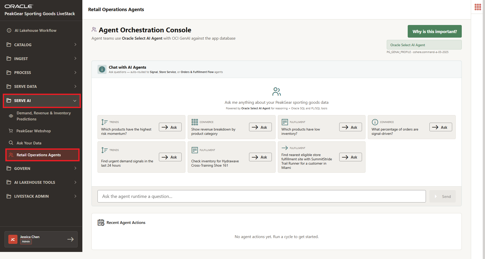
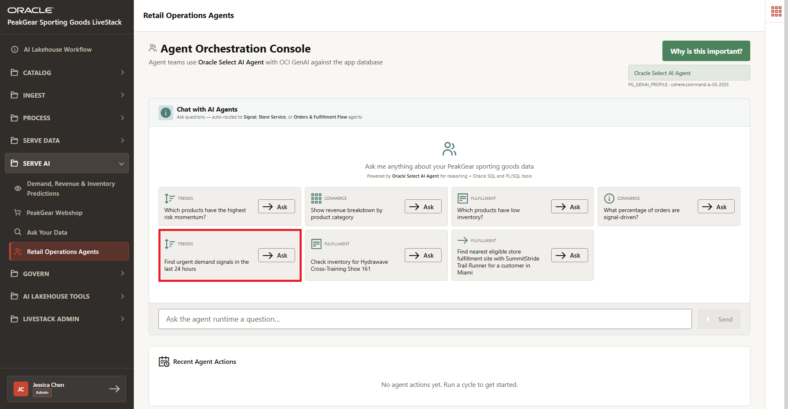
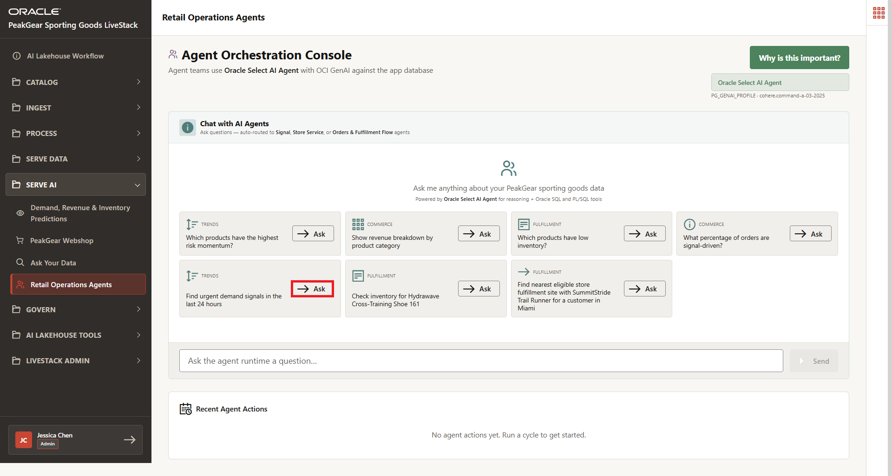
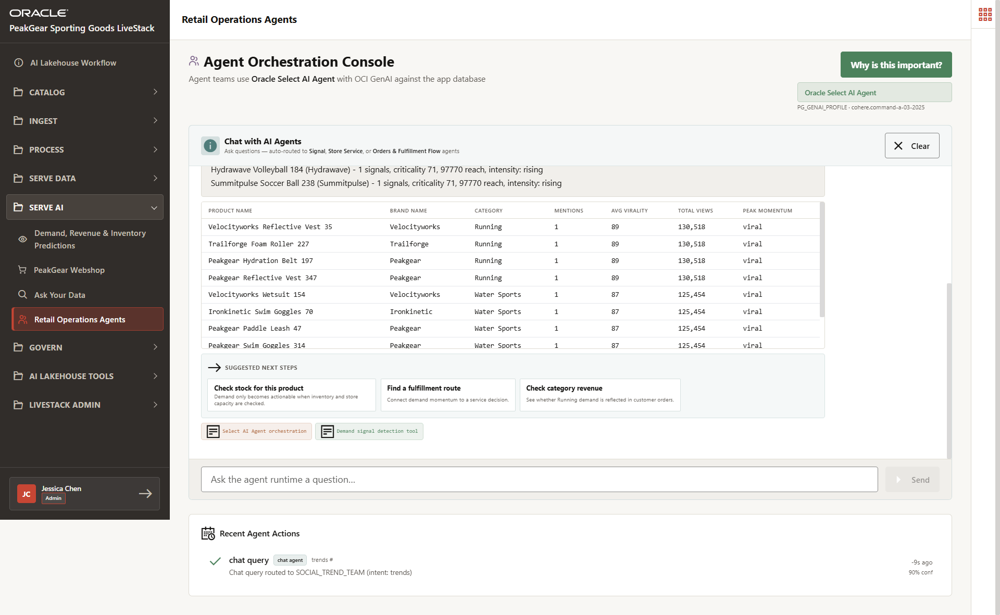
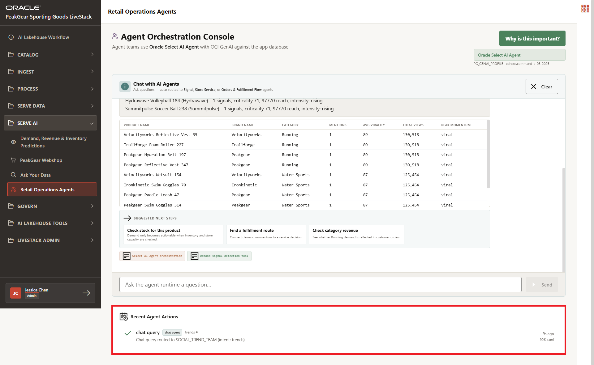

# Retail Operations Agents

## Introduction

PeakGear needs more than an answer when demand changes. Teams may need to check stock, review category revenue, find a fulfillment route, and decide what to do next.

**Retail Operations Agents** is a Serve AI experience that uses approved tools and prepared data to suggest next steps.

Oracle AI Database Select AI Agent routes each question to the appropriate agent team. The agent uses registered SQL and PL/SQL tools, and the page records recent actions for review.

The result is a faster way to review demand changes and coordinate the next operational step.

Estimated Time: **10 minutes**

### Objectives

In this scene, you will:

- Review an operational demand question.
- See how an agent uses prepared data and approved tools.
- Review suggested next steps and the evidence behind them.
- Review the recent action history.

## Task 1: Open Retail Operations Agents



Open Retail Operations Agents:

1. In the left sidebar, expand **Serve AI**.
2. Select **Retail Operations Agents**.
3. Confirm that the page title is **Agent Orchestration Console**.
4. Confirm that the runtime indicator shows **Oracle Select AI Agent**.

This page belongs to Serve AI. It uses prepared operational data to answer a question and suggest actions.

## Task 2: Review the agent question options



Review the agent question options:

1. Review the example question tiles.
2. Notice that the questions map to different operational domains, including demand signals, fulfillment, commerce, inventory, and route planning.
3. Focus on the **Find urgent demand signals in the last 24 hours** question.

The example questions cover demand, fulfillment, commerce, inventory, and route planning. The application sends each question to the matching Select AI Agent team and its registered tools.

## Task 3: Ask for urgent demand signals



Ask for urgent demand signals:

1. Click **Ask** for:

    ```text
    Find urgent demand signals in the last 24 hours
    ```

2. Wait for the response.
3. Review the ranked products and signal metrics.
4. Review the **Suggested next steps**, such as checking stock, finding a fulfillment route, or checking category revenue.
5. Review the tool indicators below the response.



This task shows how one demand question can produce both a result and suggested actions for inventory, fulfillment, and commerce.

If the native Select AI Agent team call takes longer than the demo timeout, the UI may answer through the same registered Oracle SQL and PL/SQL tools. This fallback uses the same tool pattern and remains part of the demo.

## Task 4: Review recent agent actions



Review recent agent actions:

1. Scroll to **Recent Agent Actions**.
2. Review the action records created by recent agent interactions.
3. Explain that agent workflows should be traceable, not just conversational.

The recent actions area records what the agent handled and what it returned. Operational AI needs a record that users can review later.

## Conclusion: Business Outcome

Retail Operations Agents shows how PeakGear can use prepared lakehouse data to guide operational decisions. Bronze captures source events and operational records. Silver standardizes business entities and keys. Gold provides the data used by Select AI Agent teams for demand sensing, fulfillment analysis, commerce review, and action logging.

For the business, teams can review demand changes, coordinate inventory and fulfillment, and inspect the actions behind an AI response.

The Retail Operations Agents scene is complete.


## Acknowledgements

* **Author** - Kevin Lazarz August 2026
* **Contributor** - Eugenio Galiano
* **Last Updated By/Date** - Kevin Lazarz  August 2026
