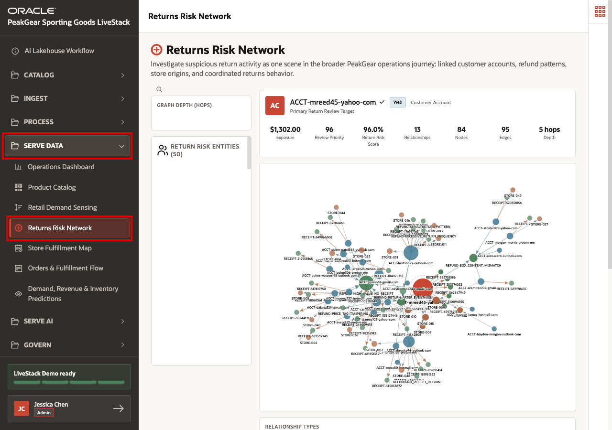
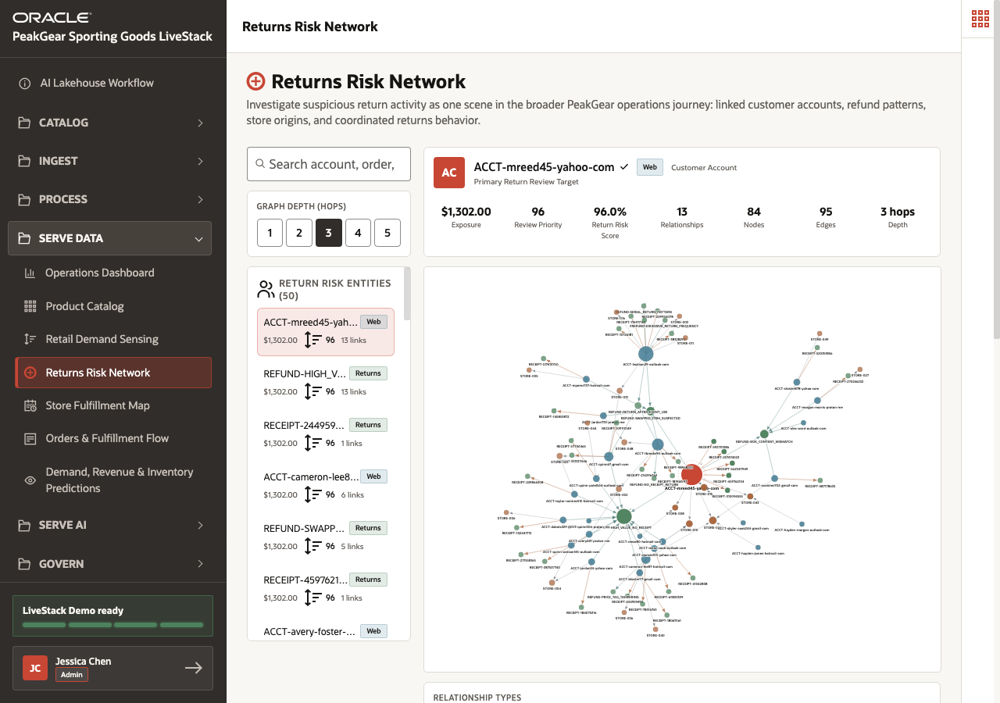
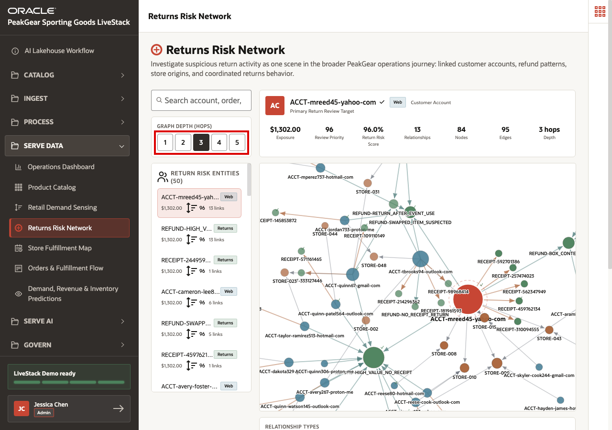
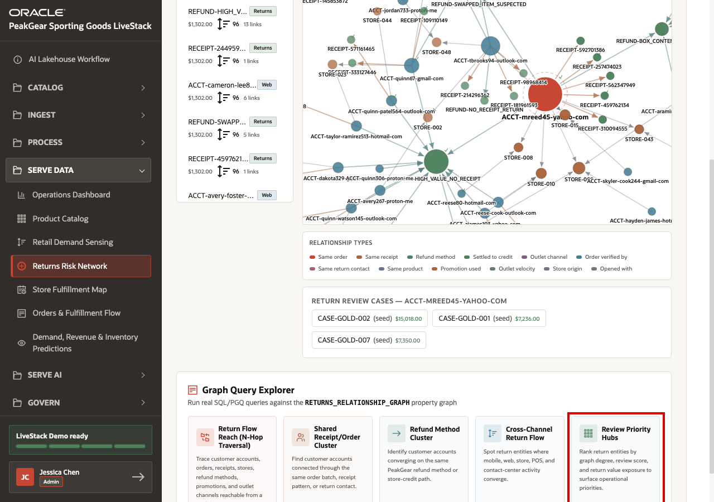
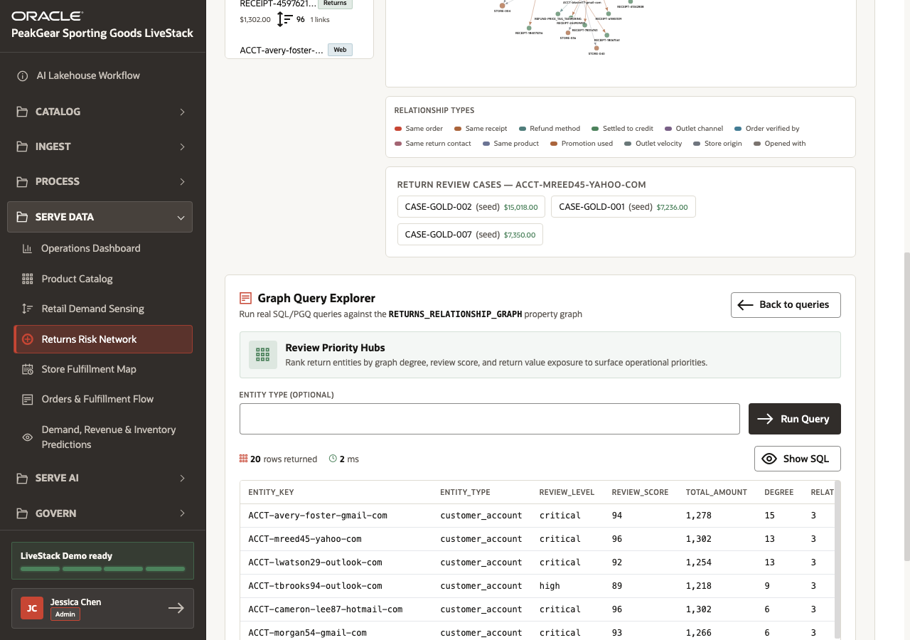

# Scene 9 Returns Risk Network

## Introduction

PeakGear has already moved operational data through the AI Lakehouse medallion process. Return events, customer accounts, orders, receipts, stores, refund methods, promotions, and channel activity can start as separate source records. Bronze preserves those source-shaped records, Silver standardizes and connects them, and Gold can serve a relationship model that the business can investigate.

The business problem is that return risk is rarely obvious in a single row. One return may look normal. A shared receipt, repeated refund method, connected account, store origin, promotion pattern, or outlet channel may only become suspicious when the relationships are visible together. If PeakGear only looks at isolated return transactions, service teams may miss coordinated behavior and operations teams may not know which cases deserve priority.

**Returns Risk Network** shows a graph-based Serve Data outcome from the AI Lakehouse. The graph turns curated Gold-layer entities and relationships into an investigation view. Users can start with a specific return-risk entity, inspect connected accounts and refund patterns, adjust relationship depth, and run graph queries that rank review-priority hubs.

Estimated Time: **10 minutes**

### Objectives

In this scene, you will:

- Open **Returns Risk Network** from the **Serve Data** menu.
- Investigate a specific return-risk entity and its connected graph.
- Adjust graph depth to explore relationship reach.
- Run a graph query to rank review-priority hubs.
- Connect graph analysis to Gold-layer business outcomes.

## Task 1: Open Returns Risk Network

1. In the left sidebar, expand **Serve Data**.
2. Select **Returns Risk Network**.
3. Confirm that the page title is **Returns Risk Network**.

This page is a Serve Data experience. The return-risk graph is not another data-preparation step. It is a business-facing investigation view built on data that has already been standardized and connected through the AI Lakehouse process.

## Task 2: Review a return-risk entity

1. Review the selected entity **ACCT-mreed45-yahoo-com**.
2. Review the risk metrics: **Exposure** `$1,302.00`, **Review Priority** `96`, **Return Risk Score** `96.0%`, **Relationships** `13`, **Nodes** `84`, and **Edges** `95`.
3. Review the connected graph for related accounts, receipts, stores, and refund methods.
4. Review the **Return Risk Entities** list on the left to see other entities with similar exposure and review-priority scores.

The graph makes return context visible. Instead of asking a user to manually compare account rows, receipt rows, store rows, and refund rows, the Serve Data view shows connected behavior around a selected entity.

## Task 3: Adjust graph depth

1. Use **Graph Depth (Hops)** to select **3**.
2. Review how the graph changes as the relationship radius changes.
3. Compare the selected account against nearby entities such as **REFUND-HIGH\_VALUE\_NO_RECEIPT** and **RECEIPT-244959493**.

Graph depth controls how far the investigation moves from the selected entity. A shallow graph helps review immediate evidence. A deeper graph helps identify clusters and indirect relationships that may matter for a return-risk review.

## Task 4: Open the Graph Query Explorer

1. Scroll to **Graph Query Explorer**.
2. Select **Review Priority Hubs**.
3. Use this query to rank return entities by graph degree, review score, and return value exposure.

The query explorer shows that the graph is not only a visualization. PeakGear can query the same relationship model to produce ranked operational lists for review teams.

## Task 5: Review priority hub results

1. Click **Run Query**.
2. Confirm that the query returns **20 rows**.
3. Review the top-ranked entities, including **ACCT-avery-foster-gmail-com** with degree `15`, review score `94`, and total amount `1,278`, and **ACCT-mreed45-yahoo-com** with degree `13`, review score `96`, and total amount `1,302`.
4. Explain how a review team could use this output to prioritize connected return-risk cases.

The result turns graph relationships into a prioritized worklist. This is the operational payoff: graph analytics can find high-degree, high-score return hubs that would be difficult to identify from separate reports.

## Conclusion: Business Outcome

Returns Risk Network shows how PeakGear can use the AI Lakehouse to move from transaction review to relationship-aware investigation. The business can see connected accounts, receipts, stores, refund methods, and return cases in one governed view instead of exporting data to separate tools or manually reconciling disconnected reports.

The medallion process makes the graph reliable. Bronze captures return, order, customer, store, and refund source data. Silver standardizes keys and relationship evidence. Gold serves a graph data product that can support interactive investigation and ranked review queries.

For the business, this means service and operations teams can prioritize suspicious return clusters earlier, reduce loss exposure, protect inventory, and make policy decisions from connected evidence rather than isolated transactions.

You can move to the next scene.

## Credits & Build Notes
- **Author** - Oracle LiveLabs Team
- **Last Updated By/Date** - Oracle LiveLabs Team, 2026-06-12
