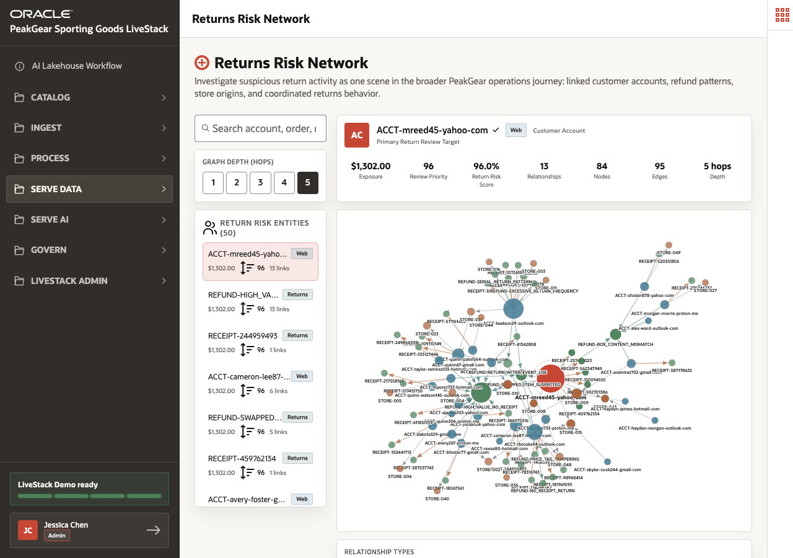

# Scene 8 Returns Risk Network

## Introduction

Returns are not only a service workflow. They can reveal repeated behavior, shared addresses, linked accounts, common products, or unusual return clusters. Retail teams need to investigate those relationships without exporting data to a separate graph platform.

This scene shows how the **Returns Risk Network** uses graph analytics to make connected return activity visible.

Estimated Time: **10 minutes**

### Objectives

In this scene, you will:

- Review return-risk entities and relationships.
- Use graph exploration to investigate connected activity.
- Connect graph evidence to the broader retail operations story.
- Explain why graph analytics belongs on the same governed data platform.

## Task 1: Explore the returns risk graph

1. Open **Serve Data** and select **Returns Risk Network**.
2. Review the graph view and the entity list.
3. Use the visible data scale to explain the graph foundation: **2,868 graph nodes**, **2,598 graph edges**, and **270 graph links**.
4. Select an entity or case to inspect the relationship context.

## Task 2: Tell the returns-risk story

1. Explain that the graph helps identify connected return behavior that a row-by-row report may miss.
2. Review any displayed neighbors, relationship paths, or entity details.
3. Connect the graph finding to operational actions: investigate suspicious return clusters, adjust policy handling, protect inventory, or support service teams with better context.
4. Emphasize that returns intelligence is one part of the broader retail operations intelligence story.

You can move to the next scene.

## Credits & Build Notes
- **Author** - Oracle LiveLabs Team
- **Last Updated By/Date** - Oracle LiveLabs Team, 2026-06-05
