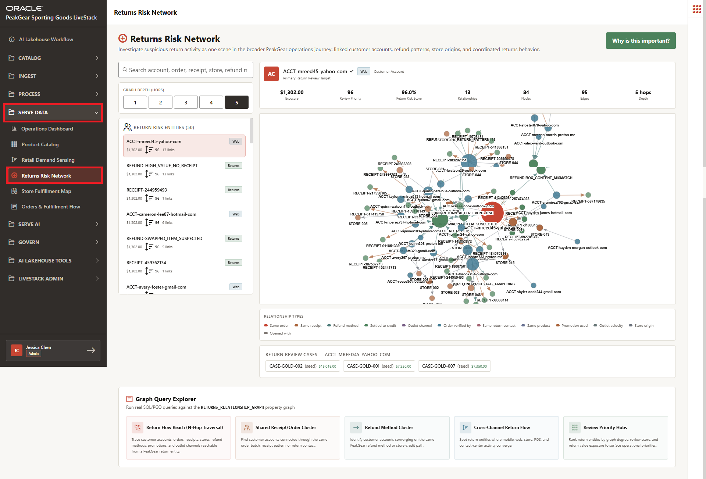
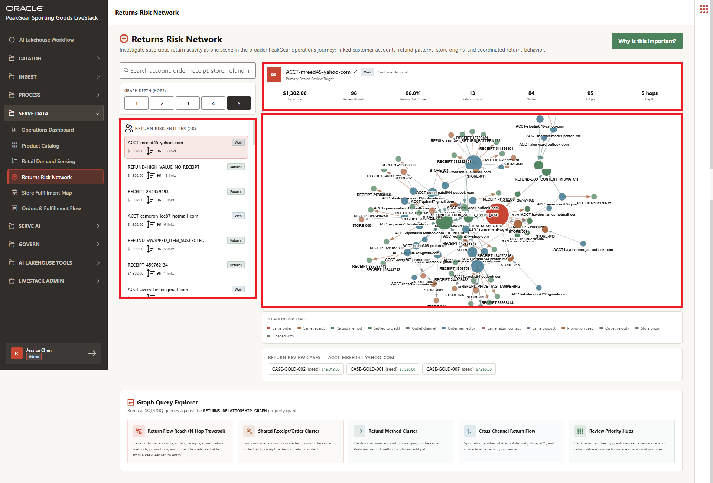
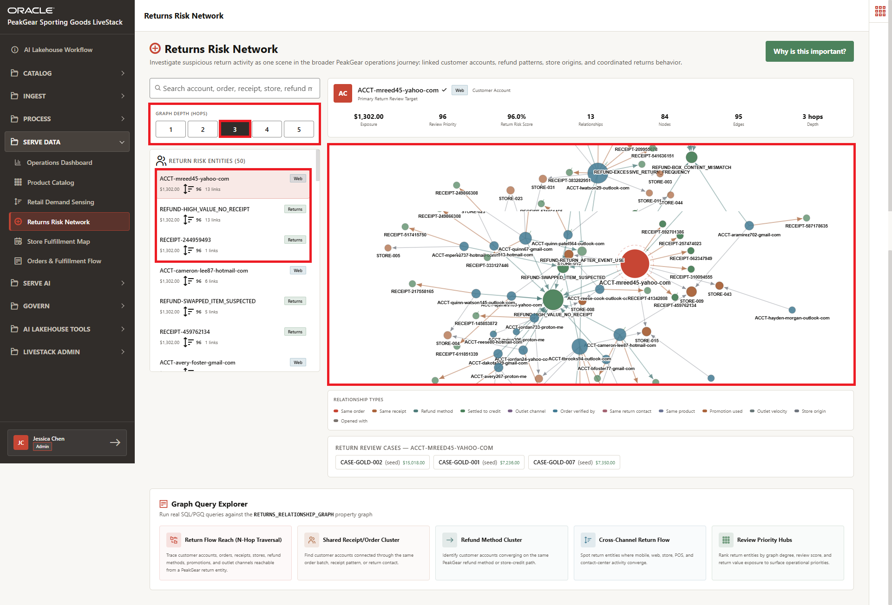
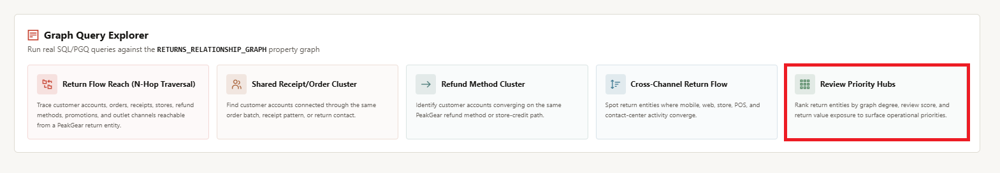
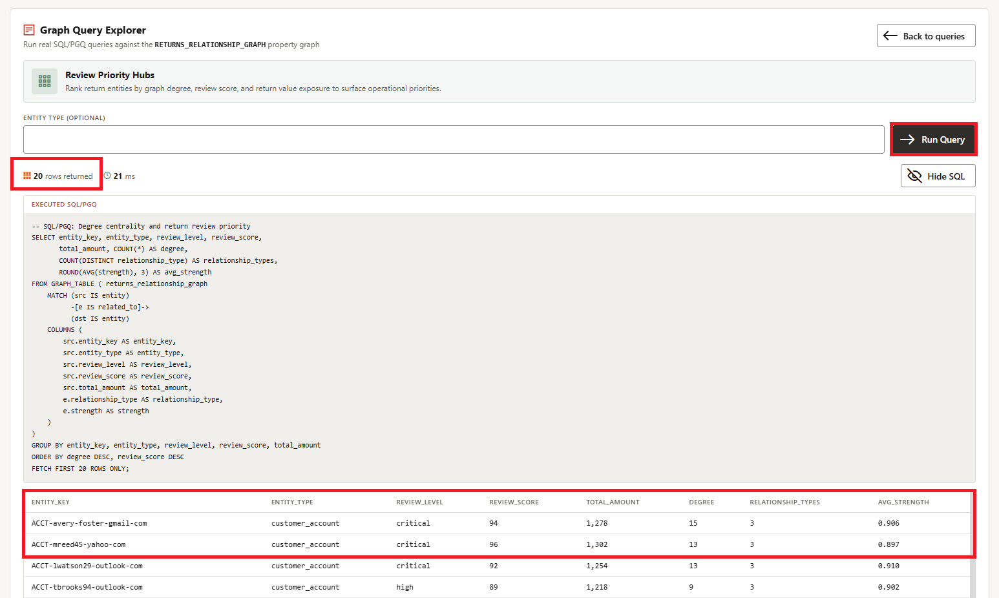

# Returns Risk Network

## Introduction

**PeakGear** has prepared its operational data through the **AI Lakehouse** medallion process. This scene focuses on return risk by showing how accounts, receipts, stores, refund methods, and return cases connect.

A single return may look normal on its own. Related records can show a different pattern when viewed together.

**Returns Risk Network** presents those relationships in a graph. A graph shows records as nodes and their relationships as connections, making related cases easier to review.

**Oracle Spatial and Graph** models these relationships, and graph queries rank cases for review.

Estimated Time: **10 minutes**

### Objectives

In this scene, you will:

- Review a return-risk case and its related records.
- Explore how changing graph depth changes the investigation.
- Run a query that ranks cases for review.
- See how connected data supports return-risk decisions.

## Task 1: Open Returns Risk Network

Open **Returns Risk Network**:

1. In the left sidebar, expand **Serve Data**.
2. Select **Returns Risk Network**.
3. Confirm that the page title is **Returns Risk Network**.

This page belongs to Serve Data. It uses return and operational data that the AI Lakehouse has already prepared.

## Task 2: Review a return-risk entity

Review a return-risk entity:

1. Review the selected entity **ACCT-mreed45-yahoo-com**.
2. Review the risk metrics: **Exposure** `$1,302.00`, **Review Priority** `96`, **Return Risk Score** `96.0%`, **Relationships** `13`, **Nodes** `84`, and **Edges** `95`.
3. Review the connected graph for related accounts, receipts, stores, and refund methods.
4. Review the **Return Risk Entities** list on the left to see other entities with similar exposure and review-priority scores.

The graph brings account, receipt, store, and refund information together around the selected entity.

**Note:** Sample values may change after data refreshes or rebuilds. Focus on the expected result pattern and the business takeaway, not the exact values.

## Task 3: Adjust graph depth

Adjust graph depth and compare connected evidence:

1. Use **Graph Depth (Hops)** to select **3**.
2. Review how the graph changes as the relationship radius changes.
3. Compare the selected account against nearby entities such as **REFUND-HIGH\_VALUE\_NO_RECEIPT** and **RECEIPT-244959493**.

Graph depth controls how far the review extends from the selected entity. A shallow view shows direct relationships. A deeper view shows indirect relationships and clusters.

## Task 4: Open the Graph Query Explorer

Open the **Graph Query Explorer**:

1. Scroll to **Graph Query Explorer**.
2. Select **Review Priority Hubs**.
3. Use this query to rank return entities by graph degree, review score, and return value exposure.

The query explorer turns the relationship model into a ranked list for review.

## Task 5: Review priority hub results

Review priority hub results:

1. Click **Run Query**.
2. Confirm that the query returns **20 rows**.
3. Review the top-ranked entities, including **ACCT-avery-foster-gmail-com** with degree `15`, review score `94`, and total amount `1,278`, and **ACCT-mreed45-yahoo-com** with degree `13`, review score `96`, and total amount `1,302`.
4. Explain how a review team could use this output to prioritize connected return-risk cases.

The result turns connected relationships into a review list. Teams can start with high-degree, high-score return hubs.

**Note:** Sample values may change after data refreshes or rebuilds. Focus on the expected result pattern and the business takeaway, not the exact values.

## Conclusion: Business Outcome

Returns Risk Network shows how PeakGear can review return risk through connected records rather than isolated transactions. Bronze captures return, order, customer, store, and refund data. Silver standardizes the keys and relationships. Gold provides the data used by the graph and its review queries.

For the business, service and operations teams can prioritize connected return cases, review loss exposure, and protect inventory with more context.

The Returns Risk Network scene is complete.

## Acknowledgements

* **Author** - Kevin Lazarz August 2026
* **Contributor** - Eugenio Galiano
* **Last Updated By/Date** - Kevin Lazarz  August 2026
