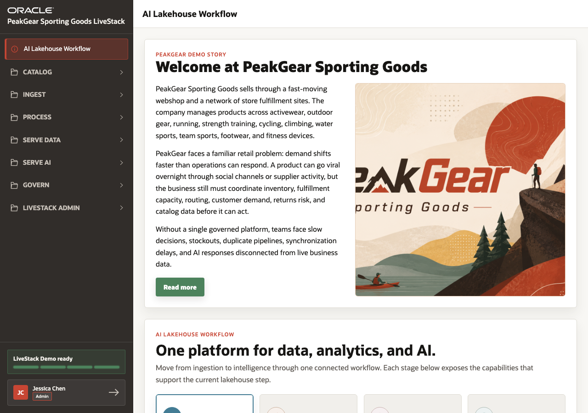

# Scene 1 Welcome and Demo Orientation

## Introduction

Retail executives and demo presenters need a simple way to explain why the PeakGear scenario matters. Demand signals, inventory, fulfillment, returns, catalog search, and AI support are connected problems, not separate screens.

This scene shows how the welcome page frames the business story and introduces the AI Lakehouse journey that the rest of the demo follows.

Estimated Time: **5 minutes**

### Objectives

In this scene, you will:

- Understand the PeakGear Sporting Goods retail scenario.
- Review the five retail challenges shown in the demo.
- Connect the demo flow to ingest, process, serve data, serve AI, and governance.
- Use the opening page as the seller talk track for the full LiveStack Demo.

## Task 1: Review the PeakGear business story

1. Open the **AI Lakehouse Workflow** page.
2. Review the **Welcome at PeakGear Sporting Goods** panel.
3. Use the story to explain the central problem: demand can shift faster than operations can respond.
4. Point out that PeakGear must coordinate products, orders, inventory, fulfillment capacity, routing, returns risk, catalog data, and AI responses.

## Task 2: Connect the story to the demo journey

1. Review the challenge cards: demand volatility, inventory imbalance, fulfillment pressure, returns relationship risk, and disconnected data and AI.
2. Review the workflow sections for **Connect & Ingest**, **Process & Prepare**, **Catalog & Understand**, **Serve Data Products**, **Serve AI Products**, and **Security & Governance**.
3. Explain that the demo starts from data movement and ends with operational applications, analytics, Select AI, and AI agents.
4. Use the live data scale as the evidence point: **650 products**, **5,000 orders**, **420 demand-signal posts**, **50 fulfillment centers**, and **2,598 graph edges**.

You can move to the next scene.

## Credits & Build Notes
- **Author** - Oracle LiveLabs Team
- **Last Updated By/Date** - Oracle LiveLabs Team, 2026-06-05
