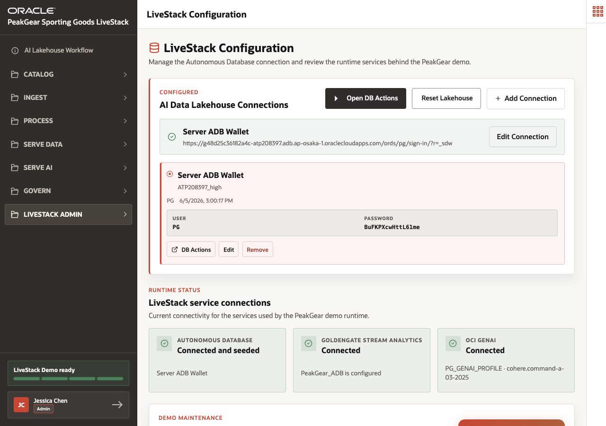

# Scene 2 LiveStack Configuration

## Introduction

A retail platform is only credible when the presenter can show that the operational services are connected and the demo data is ready. This matters for a seller because the audience should trust that the later scenes are running against live configured services, not static slides.

This scene shows how the **LiveStack Configuration** page confirms Autonomous Database, GoldenGate Stream Analytics, OCI GenAI, and demo data readiness.

Estimated Time: **5 minutes**

### Objectives

In this scene, you will:

- Confirm the LiveStack service connections.
- Review the AI Lakehouse connection configuration.
- Verify and refresh demo data from one administrative page.
- Reset the Ask PeakGear conversation state when the returns flow needs to be shown again.

## Task 1: Check service readiness

1. Open **LiveStack Admin** and select **LiveStack Configuration**.
2. Review the status area for **ADB**, **GoldenGate Stream Analytics**, and **OCI GenAI**.
3. Explain that the app uses these statuses to decide which flows are available, including Select AI and agent workflows.
4. Confirm that the sidebar readiness indicator shows when the LiveStack Demo is ready.

## Task 2: Verify the demo data foundation

1. Review the **Verify & Refresh Demo Data** area.
2. Use the visible data counts to explain the scale of the demo: **650 products**, **5,952 customers**, **5,000 orders**, **50 fulfillment centers**, **420 demand-signal posts**, and **320 demand forecasts**.
3. Explain that this page gives the presenter one place to refresh the live story before a customer session.
4. Review the **Reset customer_order_status table** action when you need to replay the Ask PeakGear return and exchange scenario.

You can move to the next scene.

## Credits & Build Notes
- **Author** - Oracle LiveLabs Team
- **Last Updated By/Date** - Oracle LiveLabs Team, 2026-06-05
