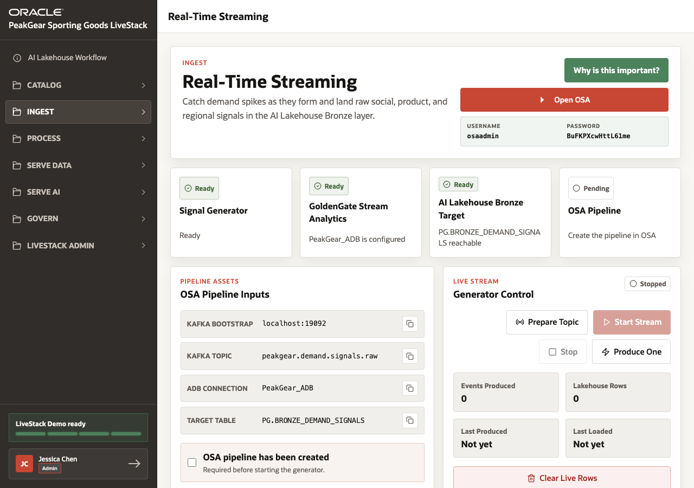
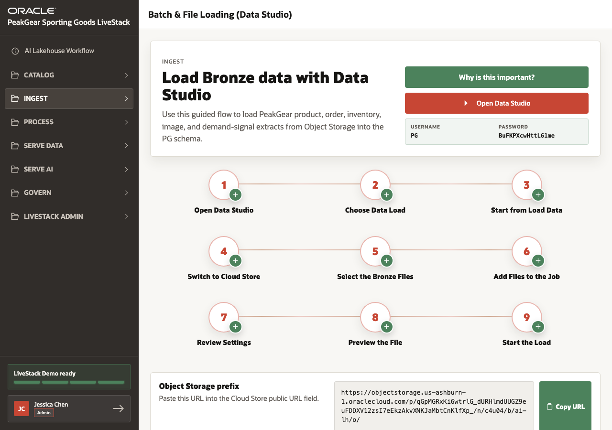

# Scene 3 Ingest Real-Time and Batch Data

## Introduction

Merchandising and operations teams need to see demand while it is forming. Waiting for a nightly batch load can leave a retailer reacting after stockouts, campaign shifts, or regional demand spikes have already happened.

This scene shows two ingest paths: real-time demand signals through Kafka and GoldenGate Stream Analytics, and batch/file loading into Bronze using Data Studio.

Estimated Time: **10 minutes**

### Objectives

In this scene, you will:

- Review the real-time streaming path into the AI Lakehouse.
- Understand why raw demand signals land in Bronze.
- Review batch/file loading into Bronze through Data Studio.
- Connect ingest to the later analytics and AI scenes.

## Task 1: Review real-time streaming

1. Open **Ingest** and select **Real-Time Streaming**.
2. Review the Open OSA button and the displayed OSA credentials.
3. Explain that the signal generator represents live digital channels while Kafka carries events to GoldenGate Stream Analytics.
4. Point out that OSA lands events into **PG.BRONZE_DEMAND_SIGNALS**, keeping the raw source-shaped data for later processing.
5. Use the visible stream controls to explain that a presenter can start the stream only after the OSA pipeline is ready.

## Task 2: Review Bronze batch loading

1. Open **Ingest** and select **Batch & File Loading (Data Studio)**.
2. Review the numbered Data Studio steps.
3. Expand a step to show the screenshot and instruction panel.
4. Review the Object Storage prefix and copy action for the PAR URL.
5. Explain that file loading complements streaming when PeakGear needs to land product, order, inventory, image, and demand data into Bronze.

You can move to the next scene.

## Credits & Build Notes
- **Author** - Oracle LiveLabs Team
- **Last Updated By/Date** - Oracle LiveLabs Team, 2026-06-05
