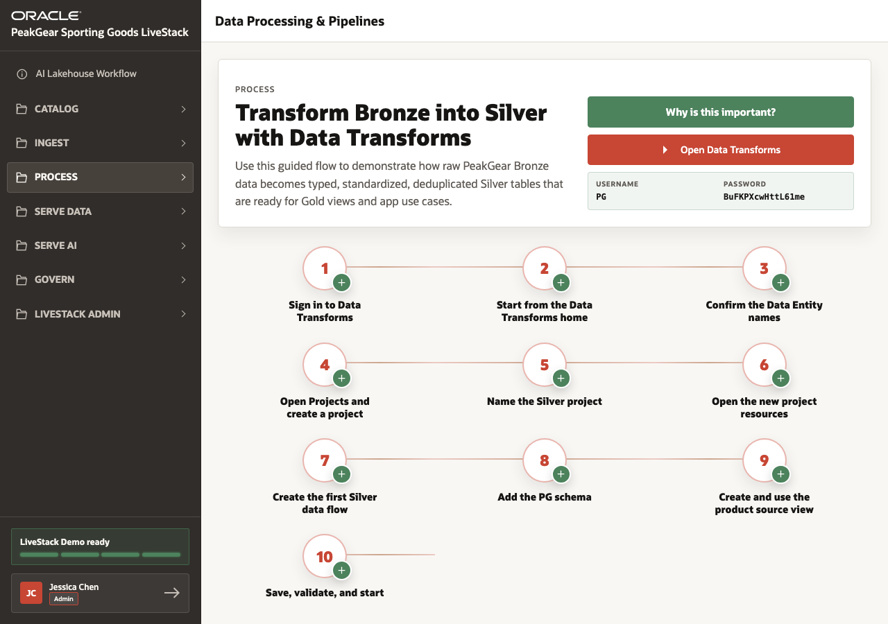

# Scene 4 Process Bronze to Silver

## Introduction

Raw data is useful only if it can be standardized, governed, and reused. Retail teams need trusted product, inventory, demand, order, and fulfillment data before dashboards, search, forecasts, and AI agents can act on it.

This scene shows how Data Transforms supports the Silver processing layer in the AI Lakehouse story.

Estimated Time: **5 minutes**

### Objectives

In this scene, you will:

- Review the Bronze-to-Silver processing flow.
- Understand why Silver standardizes raw ingested data.
- Connect processed Silver data to curated catalog, analytics, forecasts, and AI experiences.
- Use the Data Transforms path as the practical presenter guide.

## Task 1: Review the Silver flow setup

1. Open **Process** and select **Data Processing & Pipelines**.
2. Review the numbered Data Transforms steps.
3. Expand the first few steps to show how the presenter signs in, starts from the Data Transforms home, and creates the processing flow.
4. Explain that Silver data reduces duplicate transformation logic across the webshop, dashboard, demand sensing, and AI experiences.

## Task 2: Connect Silver processing to data products

1. Review the **Data Transforms path** and **Silver flow checklist** panels.
2. Point out that the demo uses **650 products** and related order, fulfillment, demand, image, and forecast data as downstream proof points.
3. Explain that the same governed transformation path prepares data for curated catalog views, product discovery, operations dashboards, and Select AI.

You can move to the next scene.

## Credits & Build Notes
- **Author** - Oracle LiveLabs Team
- **Last Updated By/Date** - Oracle LiveLabs Team, 2026-06-05
