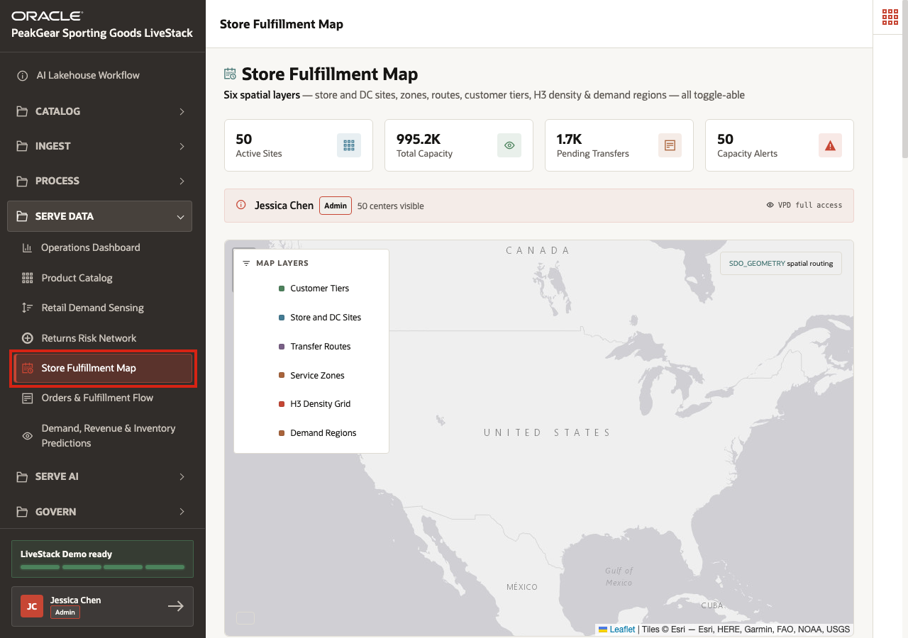
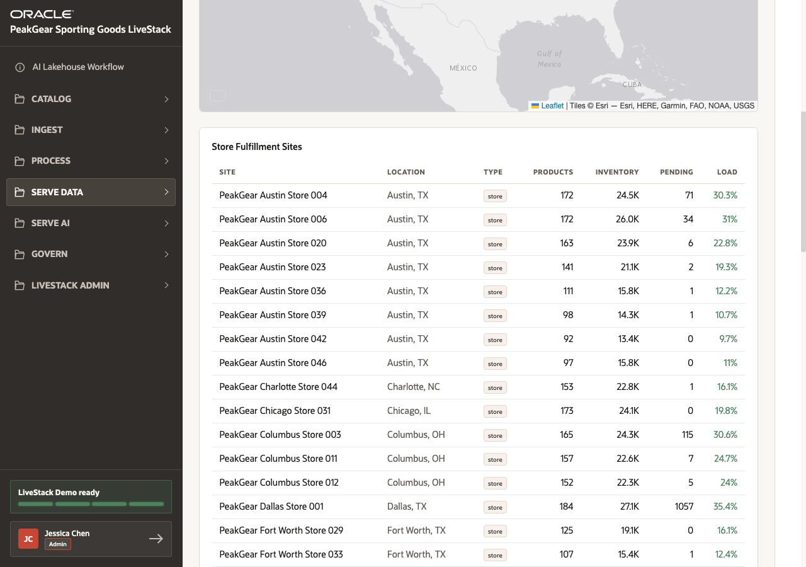
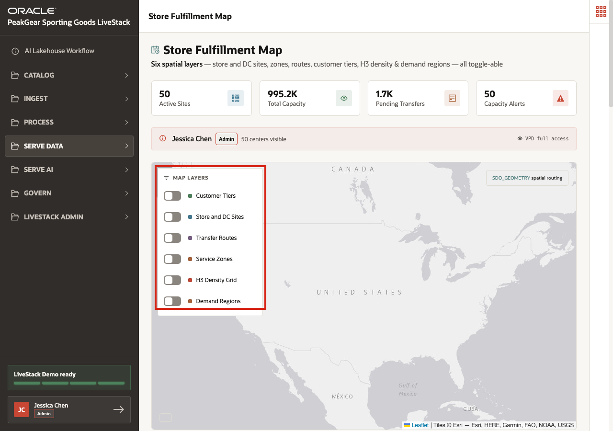

# Scene 11 Store Fulfillment Map

## Introduction

PeakGear has already moved fulfillment, inventory, customer, order, and demand data through the AI Lakehouse medallion process. Bronze captures the source-shaped records, Silver standardizes locations and operational keys, and Gold can serve a spatial fulfillment data product that business users can inspect directly.

The business challenge is location. A product may be available somewhere in the network, but PeakGear still needs to know which store or distribution site can serve the customer, how much capacity is available, where pending transfers are building up, and which service zones are under pressure. Without a governed spatial layer, teams would have to export coordinates into separate mapping tools, reconcile those results with inventory reports, and then manually translate the answer back into fulfillment actions.

**Store Fulfillment Map** shows how spatial data becomes a Serve Data outcome from the AI Lakehouse. Oracle AI Database can manage location as a native data type through Oracle Spatial, including points, routes, zones, and demand regions. That means the same governed Gold-layer foundation can support proximity analysis, service coverage, customer-density overlays, and regional fulfillment decisions without moving the data into a separate geospatial platform.

Estimated Time: **10 minutes**

### Objectives

In this scene, you will:

- Open **Store Fulfillment Map** from the **Serve Data** menu.
- Review fulfillment capacity across active store sites.
- Inspect spatial layers such as store locations, routes, service zones, customer tiers, H3 density, and demand regions.
- Use a concrete fulfillment site to connect spatial context to operational decisions.
- Connect spatial analytics to Gold-layer business outcomes.

## Task 1: Open Store Fulfillment Map

1. In the left sidebar, expand **Serve Data**.
2. Select **Store Fulfillment Map**.
3. Confirm that the page title is **Store Fulfillment Map**.

This page is a Serve Data experience. The user is not preparing raw location data. They are consuming spatial intelligence that has already been curated through the AI Lakehouse process.

## Task 2: Review fulfillment capacity

1. Review the summary cards at the top of the page: **50 Active Sites**, **995.2K Total Capacity**, **1.7K Pending Transfers**, and **50 Capacity Alerts**.
2. Scroll to **Store Fulfillment Sites**.
3. Use **PeakGear Austin Store 004** as the demo point.
4. Review its live values: **172 Products**, **24.5K Inventory**, **71 Pending**, and **30.3% Load**.
5. Compare that site with **PeakGear Dallas Store 001**, which shows **184 Products**, **27.1K Inventory**, and **1,057 Pending**.

The table turns spatial fulfillment data into operational context. A user can see where capacity exists, where transfers are accumulating, and which sites may need attention before a fulfillment problem becomes visible to customers.

## Task 3: Inspect spatial layers

1. Use **Map Layers** to review the available spatial overlays.
2. Toggle layers such as **Store and DC Sites**, **Transfer Routes**, **Service Zones**, **H3 Density Grid**, and **Demand Regions**.
3. Explain that these overlays represent different spatial questions: where sites are located, where customers cluster, how routes connect nodes, and where demand regions are heating up.
4. Keep the demo focused on business interpretation rather than configuring the map.

The important point is that spatial is not an isolated add-on. Oracle Spatial lets PeakGear keep location data with the governed operational data. That allows the Gold layer to serve a map, a dashboard, a routing query, or a machine-learning feature from the same trusted foundation.

## Task 4: Connect the map to fulfillment decisions

1. Use **PeakGear Austin Store 004** and **PeakGear Dallas Store 001** as comparison points.
2. Explain that a fulfillment planner can evaluate capacity, pending transfers, and nearby demand before deciding where to route or rebalance.
3. Relate the spatial layers back to the medallion process:

- **Bronze** captured source locations, inventory snapshots, transfer events, customer records, and demand regions.
- **Silver** standardized locations, store identifiers, region labels, and operational relationships.
- **Gold** serves a spatial fulfillment data product that the map can use directly.

This is the architecture pattern repeated throughout the demo: source data enters the AI Lakehouse, the medallion process turns it into trusted data, and Serve Data experiences expose it as a business workflow.

## Conclusion: Business Outcome

Store Fulfillment Map shows how PeakGear can turn location into an operational advantage. Instead of exporting data to separate GIS tools and manually reconciling the result with inventory reports, users can inspect capacity, demand regions, service zones, routes, and customer density from one governed data product.

The medallion process makes the spatial view reliable. Bronze captures source records, Silver standardizes them, and Gold serves curated spatial and operational data together. Oracle Spatial then lets the business analyze points, routes, zones, and regions natively inside the Oracle AI Database foundation.

For the business, this means fulfillment teams can route orders more effectively, identify regional pressure earlier, rebalance inventory with better context, and reduce the cost and complexity of disconnected spatial integration.

You can move to the next scene.

## Credits & Build Notes
- **Author** - Oracle LiveLabs Team
- **Last Updated By/Date** - Oracle LiveLabs Team, 2026-06-12
