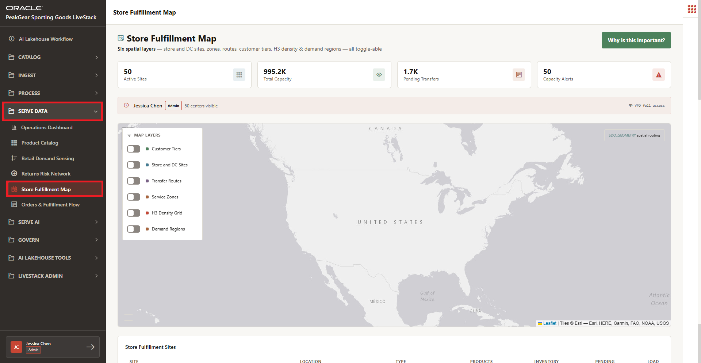
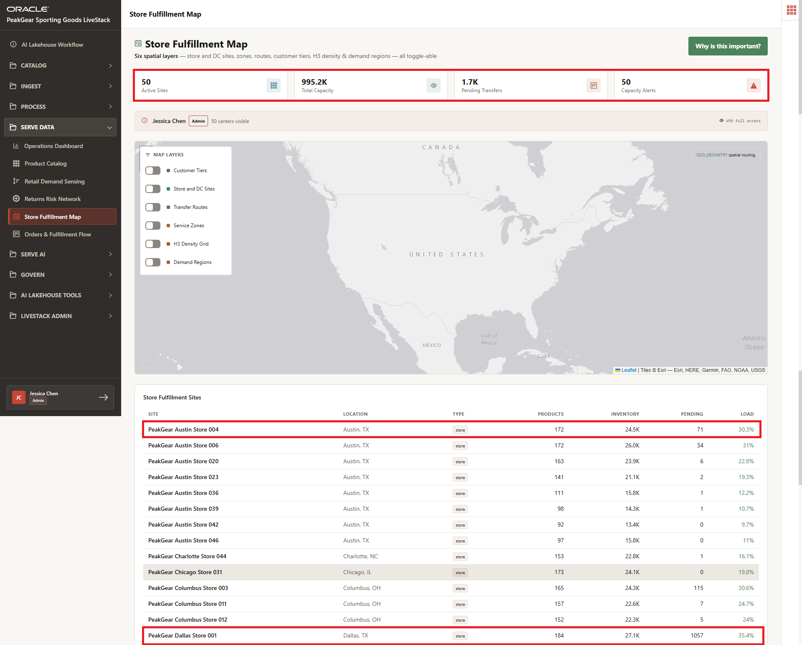
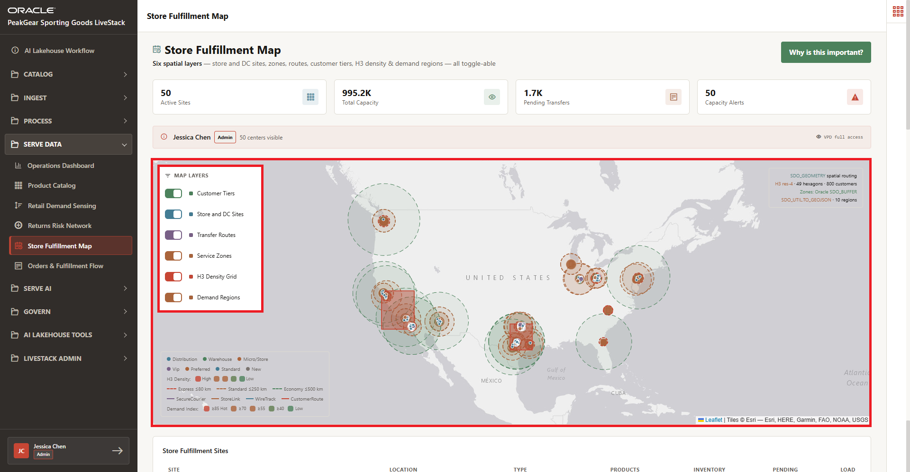

# Store Fulfillment Map

## Introduction

**PeakGear** has prepared fulfillment, inventory, customer, order, and demand data through the **AI Lakehouse** medallion process. This scene adds location to that same data flow.

A product may be available somewhere in the network, but planners also need to know which site can serve the customer, how much capacity is available, and where transfers or demand are building.

**Store Fulfillment Map** presents this location context as a Serve Data experience. Spatial data describes sites, routes, zones, and demand regions.

**Oracle Spatial** keeps location data with the operational data, while H3 density grids show regional patterns.

Estimated Time: **10 minutes**

### Objectives

In this scene, you will:

- Review capacity across fulfillment sites.
- Explore locations, routes, service zones, and demand regions.
- Compare two sites using capacity and transfer data.
- See how location data supports fulfillment decisions.

## Task 1: Open Store Fulfillment Map

Open Store Fulfillment Map:

1. In the left sidebar, expand **Serve Data**.
2. Select **Store Fulfillment Map**.
3. Confirm that the page title is **Store Fulfillment Map**.

This page belongs to Serve Data. It uses location and operational data prepared through the AI Lakehouse process.

## Task 2: Review fulfillment capacity

Review fulfillment capacity:

1. Review the summary cards at the top of the page: **50 Active Sites**, **995.2K Total Capacity**, **1.7K Pending Transfers**, and **50 Capacity Alerts**.
2. Scroll to **Store Fulfillment Sites**.
3. Use **PeakGear Austin Store 004** as the demo point.
4. Review its live values: **172 Products**, **24.5K Inventory**, **71 Pending**, and **30.3% Load**.
5. Compare that site with **PeakGear Dallas Store 001**, which shows **184 Products**, **27.1K Inventory**, and **1,057 Pending**.

The table puts site capacity, inventory, and pending transfers together. A planner can see where capacity exists and where transfers are accumulating.

**Note:** Sample values may change after data refreshes or rebuilds. Focus on the expected result pattern and the business takeaway, not the exact values.

## Task 3: Inspect spatial layers

Inspect spatial layers:

1. Use **Map Layers** to review the available spatial overlays.
2. Toggle layers such as **Store and DC Sites**, **Transfer Routes**, **Service Zones**, **H3 Density Grid**, and **Demand Regions**.
3. Explain that these overlays represent different spatial questions: where sites are located, where customers cluster, how routes connect nodes, and where demand regions are heating up.
4. Keep the demo focused on business interpretation rather than configuring the map.

Oracle Spatial lets PeakGear keep location data with the operational data. The Gold layer can then provide the data for maps, dashboards, routes, and other business views.

## Task 4: Connect the map to fulfillment decisions

Connect the map to fulfillment decisions:

1. Use **PeakGear Austin Store 004** and **PeakGear Dallas Store 001** as comparison points.
2. Explain that a fulfillment planner can evaluate capacity, pending transfers, and nearby demand before deciding where to route or rebalance.
3. Relate the spatial layers back to the medallion process:

- **Bronze** captured source locations, inventory snapshots, transfer events, customer records, and demand regions.
- **Silver** standardized locations, store identifiers, region labels, and operational relationships.
- **Gold** serves a spatial fulfillment data product that the map can use directly.

The same pattern appears across the demo: source data enters the AI Lakehouse, the medallion process prepares it, and Serve Data presents it for a business task.

## Conclusion: Business Outcome

Store Fulfillment Map shows how PeakGear can use location and operational data together. Users can review capacity, demand regions, service zones, routes, and customer density in one view.

Bronze captures source records, Silver standardizes them, and Gold provides the spatial and operational data used by the map. Oracle Spatial supports analysis of points, routes, zones, and regions inside the Oracle AI Database.

For the business, fulfillment teams can compare sites, spot regional pressure, and make routing or inventory decisions with more context.

The Store Fulfillment Map scene is complete.

## Acknowledgements

* **Author** - Kevin Lazarz August 2026
* **Contributor** - Eugenio Galiano
* **Last Updated By/Date** - Kevin Lazarz  August 2026
