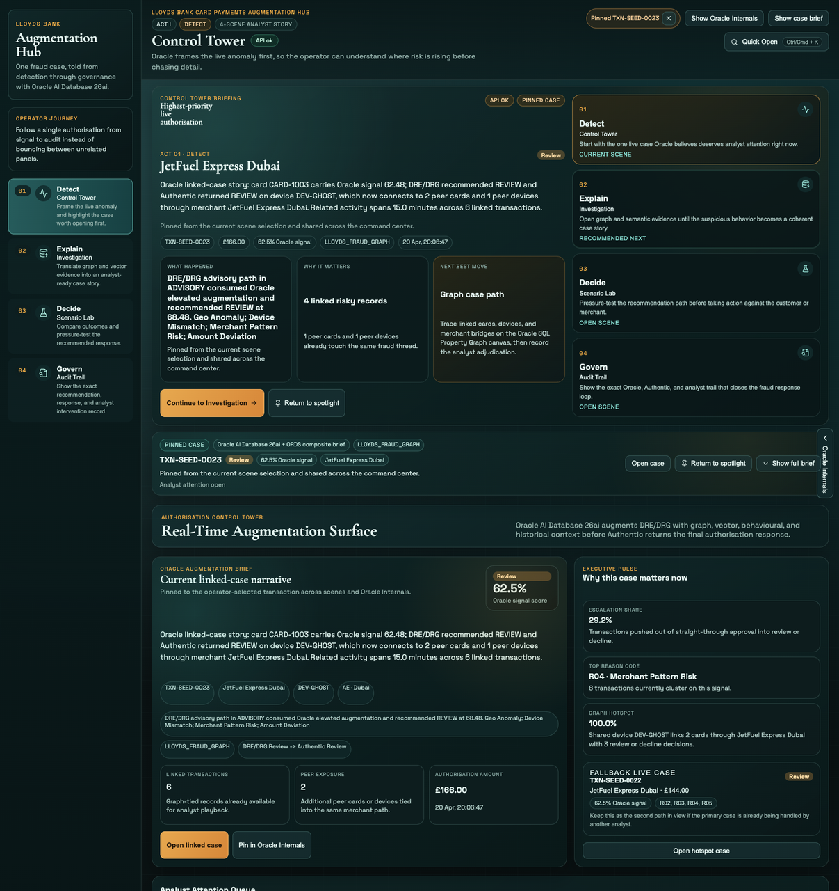

# Oracle-Augmented Card Authorisation LiveStack

## Introduction

LiveLabs LiveStacks are real-working demos! 

In this LiveStack, Oracle AI Database 26ai turns a live authorisation into one continuous operator story. The app now leads with a single high-priority case in the Control Tower, keeps Oracle Internals aligned to that same record, opens the case into Investigation before any broader branching, lets Scenario Lab rehearse decisions from the active baseline, and closes with governance in Audit Trail. Dataset Admin remains available as an operator utility on the side, so the main walkthrough stays focused on the live fraud narrative instead of jumping between unrelated tools.

Estimated Workshop Time: 1 hour 20 minutes

### Objectives

In this workshop, you will:
- Navigate the full case-led scene flow: Authorisation Control Tower, Oracle Internals Evidence Rail, Investigation Workbench, Scenario Lab, and Dataset Admin & Audit Trail.
- Follow one live transaction across the app instead of reopening the case in each scene.
- Connect each scene to the Oracle evidence surfaced through ORDS, PL/SQL, Oracle Internals, SQL Property Graph, Oracle Text, AI Vector Search, and the dataset-job ledger.
- Run the LiveStack locally with Podman Compose and bootstrap the required Ollama models.
- Validate the end-to-end augmentation contract: Oracle signal, DRE/DRG recommendation, Authentic final response, analyst controls, and governance replay.

### Prerequisites (If run locally)

This workshop assumes you have:
- Podman Compose 2.x+ with local `podman` access.
- Browser access to `http://localhost:8505`.
- Terminal access for service verification commands such as `podman compose`, `curl`, and `jq`.
- Enough local CPU, memory, and disk to run `db`, `ords`, `ollama`, and `app`.

## Workshop Flow

- Run the LiveStack locally with Podman Compose.
- Scene 1: Authorisation Control Tower
- Scene 2: Oracle Internals Evidence Rail
- Scene 3: Investigation Workbench
- Scene 4: Scenario Lab
- Scene 5: Dataset Admin & Audit Trail
- Conclusion and key takeaways

## Learn More

- [Oracle Database documentation](https://docs.oracle.com/en/database/oracle/oracle-database/)
- [Overview of Oracle AI Vector Search](https://docs.oracle.com/en/database/oracle/oracle-database/26/vecse/overview-ai-vector-search.html)
- [Oracle REST Data Services](https://docs.oracle.com/en/database/oracle/oracle-database/26/rest-data-services/index.html)

## Credits & Build Notes

- **Author** - The LiveLabs Team
- **Last Updated By/Date** - The LiveLabs Team, April 2026
