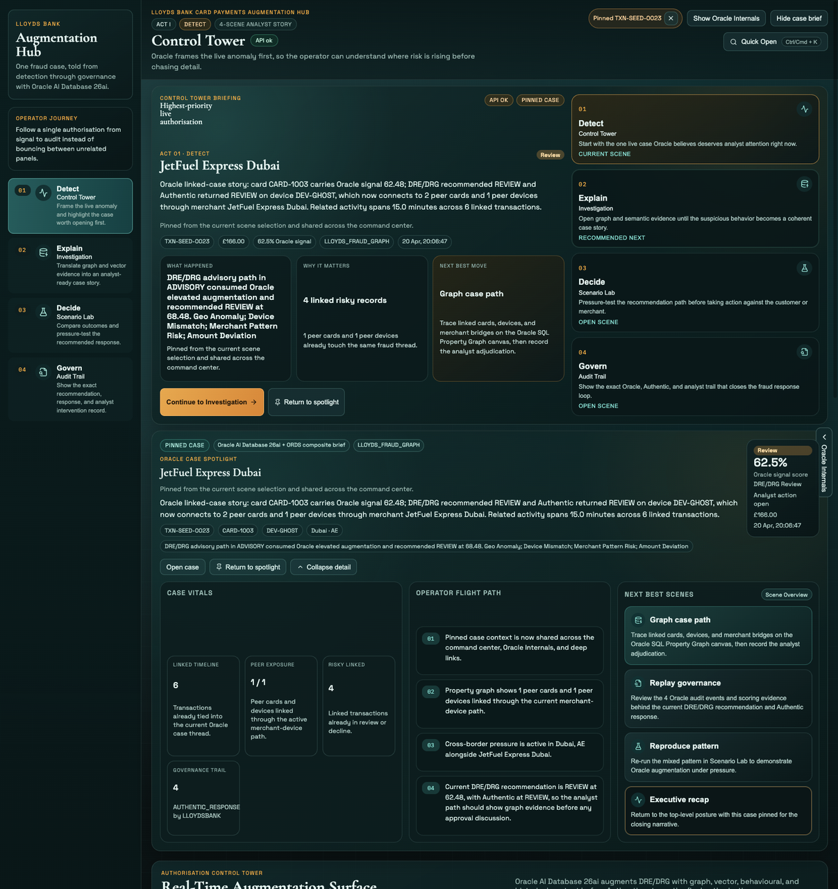

# Scene 1: Authorisation Control Tower

## Introduction

This scene introduces the shell as a guided operator story, not a dashboard collection. You will open the Control Tower, review the single live case Oracle wants the operator to handle first, and use the briefing surfaces to carry that same case into the rest of the app.

Estimated Time: 10 minutes

### Objectives

In this lab, you will:
- Open the shell and confirm the stage-based navigation.
- Identify the primary live case, fallback case, and analyst queue.
- Expand the active case brief and hand the same transaction into the next scene.

## Task 1: Open the Control Tower

1. Open the application.
2. Confirm the left rail now frames the journey as `Detect`, `Explain`, `Decide`, and `Govern`, with `Operator Dataset Admin` parked below as a utility.
3. In the story panel above the scene, confirm the Control Tower briefing is active.
4. Identify the three main working areas on screen:
    - `Current linked-case narrative`
    - `Why this case matters now`
    - `Analyst Attention Queue`

Expected result:
- The app opens on `Control Tower`, the story shell is visible, and one live case is already framed for the operator.

## Task 2: Read the live case before branching away

1. In `Current linked-case narrative`, review the selected transaction story, merchant, device, geography, and Oracle signal.
2. In `Why this case matters now`, notice the fallback live case. This is the secondary path the operator can keep in reserve if the primary case is already being handled.
3. In `Analyst Attention Queue`, review how the queue turns the live feed into intervention categories instead of a flat list.
4. Optionally scroll to `Live transaction ledger` and click a different transaction row to pin another record across the app.

Expected result:
- The Control Tower stays anchored on one dominant case, with one fallback path available and broader ledger detail only when needed.

## Task 3: Expand the case brief and follow the handoff

1. Click `Show full brief`.
2. Review the expanded summary cards, especially:
    - `What Happened`
    - `Why It Matters`
    - `Next Best Move`
3. Click `Open linked case`.
4. Confirm the app switches to `Investigation` with the same transaction already selected.
5. Use the left rail to return to `Control Tower`.

Expected result:
- The Control Tower now behaves like a briefing surface: the operator reads one case, understands why it matters, and moves forward without losing context.

## Task 4: Why this matters?

The Control Tower now does the hardest UX job first. It decides which live authorisation deserves attention, shows why it matters, and sets up a clean handoff. If this first scene works, the rest of the product feels like one investigation rather than four disconnected dashboards.

## Credits & Build Notes

- **Author** - The LiveLabs Team
- **Last Updated By/Date** - The LiveLabs Team, April 2026
