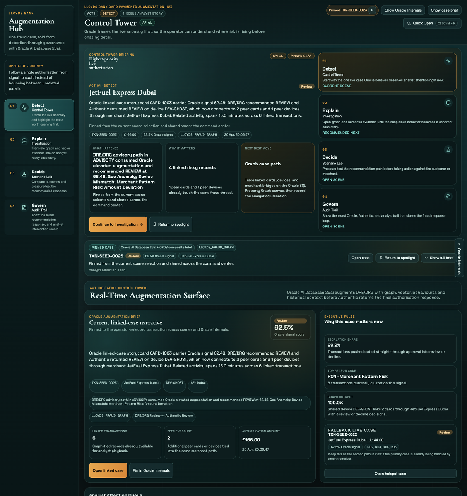
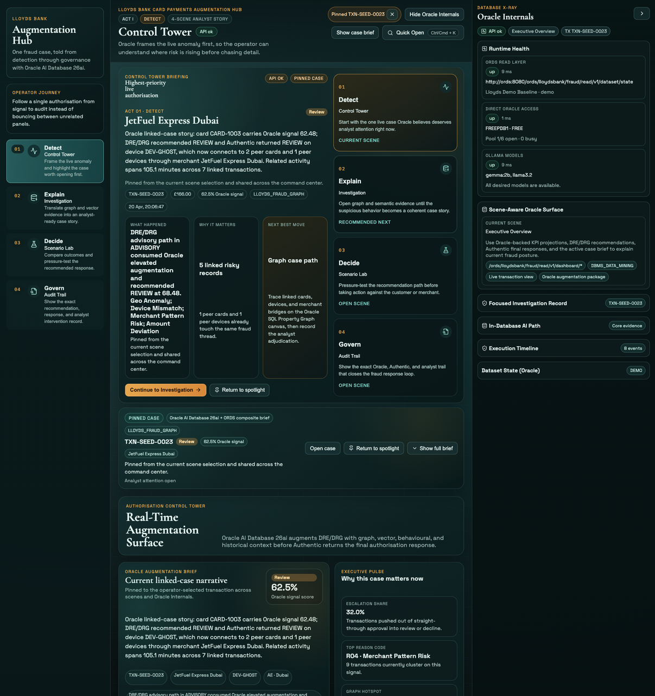

# Scene 2: Oracle Internals Evidence Rail

## Introduction

This scene stays with the same Control Tower case and opens the right-side Oracle evidence rail. You will use Oracle Internals to confirm that the UI story, runtime health, and focused-record evidence are all aligned to the same transaction.

Estimated Time: 10 minutes

### Objectives

In this lab, you will:
- Keep one Control Tower transaction in focus.
- Open Oracle Internals and inspect the scene-aware Oracle evidence.
- Confirm the same record stays synchronized across the briefing shell and the evidence rail.

## Task 1: Keep one transaction in view

1. Return to `Control Tower` if you are not already there.
2. Leave the current spotlight case pinned, or click a different row in `Live transaction ledger` if you want to switch records.
3. In `Current linked-case narrative`, review the selected case story and summary badges.
4. Note the operator actions `Open linked case` and `Pin in Oracle Internals`.

Expected result:
- The same transaction is visible in the Control Tower briefing and ready to be explained by Oracle Internals.

## Task 2: Open Oracle Internals for the same record

1. If the right rail is collapsed, click `Oracle Internals` on the far-right edge of the application.
2. Confirm the rail opens with:
    - `Runtime Health`
    - `Scene-Aware Oracle Surface`
    - `Focused Investigation Record`
    - `In-Database AI Path`
3. In `Focused Investigation Record`, verify the transaction ID matches the Control Tower case.
4. Review the DRE/DRG recommendation, Authentic final response, graph scope, and linked timeline counts.
5. Expand `In-Database AI Path` and review the Oracle engine, model, and route details.

Expected result:
- Oracle Internals refreshes to the same transaction already in view, so the case story and the Oracle evidence stay aligned.

## Task 3: Confirm the rail stays scene-aware

1. With Oracle Internals still open, use the left rail to move to `Investigation`.
2. Confirm the right rail updates its scene summary from `Executive Overview` to `Investigation Workbench`.
3. Verify the focused record still references the same transaction rather than resetting to a different case.
4. Return to `Control Tower` when you are done.

Expected result:
- Oracle Internals behaves like a living evidence rail. It changes with the scene, but it does not lose the active record.

## Task 4: Why this matters?

Operators need to trust that the case they see on screen is the same case Oracle is explaining underneath. This scene proves the evidence rail is not a decorative panel. It is the governed explanation layer for the same transaction the operator is already working.

## Credits & Build Notes

- **Author** - The LiveLabs Team
- **Last Updated By/Date** - The LiveLabs Team, April 2026
