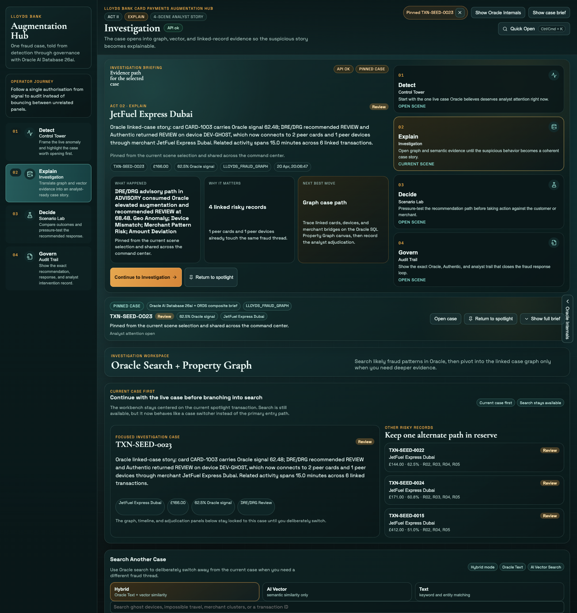
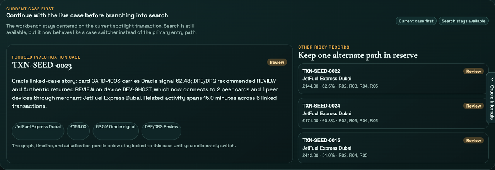
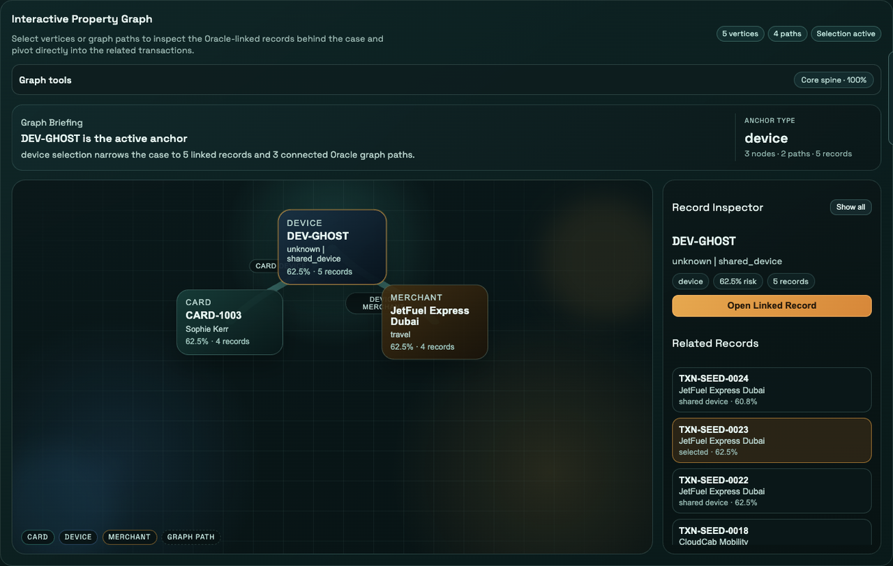

# Scene 3: Investigation Workbench

## Introduction

The Investigation workbench now opens with the current case first. You will continue the active fraud story, use Oracle search only when you deliberately need a different thread, and then inspect the same case inside the property graph.

Estimated Time: 15 minutes

### Objectives

In this lab, you will:
- Continue the active spotlight case without re-searching for it.
- Use Oracle search as a case switcher when you deliberately need another record.
- Inspect the selected transaction in the property graph and record-inspector surfaces.

## Task 1: Continue with the current case

1. Click `Investigation` in the left navigation.
2. In `Current Case First`, confirm the selected transaction is already in focus.
3. Review the lead card and alternate-risk list without using search yet.
4. Confirm the workbench is centered on the current case rather than forcing you to start with a blank search box.

Expected result:
- Investigation opens on the same case from Control Tower instead of asking you to rediscover it.

## Task 2: Switch cases only when you mean to

1. In `Search Another Case`, keep `Hybrid` selected.
2. Click the suggestion `ghost device shared across cards`, or type it into the search box yourself.
3. Review the returned result cards.
4. Switch between `Hybrid`, `AI Vector`, and `Text`.
5. Expand `Oracle retrieval details` to inspect the vector-search capability, execution mode, and Oracle Text evidence.

Expected result:
- Search remains fully available, but it behaves like a deliberate case switch rather than the default entry point.

## Task 3: Open one case in the property graph

1. Keep the current case selected, or click a different result card if you want to switch.
2. Scroll to `Property Graph Case View`.
3. Confirm the view updates to `Focused TX <transactionId>`.
4. Review the case KPI strip, especially:
    - `DRE/DRG Recommendation`
    - `Authentic Final Response`
    - `Effective Status`
    - `Fraud Score`
5. In `Interactive Property Graph`, click a node or graph path.
6. Watch `Graph Briefing` and `Record Inspector` react to your selection.
7. Optionally click `Open Linked Record` or `Open Path Record` to pivot to a connected transaction.

Expected result:
- The graph reacts directly to your clicks, and the record inspector turns those graph selections into a clear analyst path.

## Task 4: Why this matters?

Investigation only works when context is preserved. By leading with the current case and treating search as an intentional branch, the workbench now feels like a continuation of the fraud story instead of a reset in the middle of it.

## Credits & Build Notes

- **Author** - The LiveLabs Team
- **Last Updated By/Date** - The LiveLabs Team, April 2026
