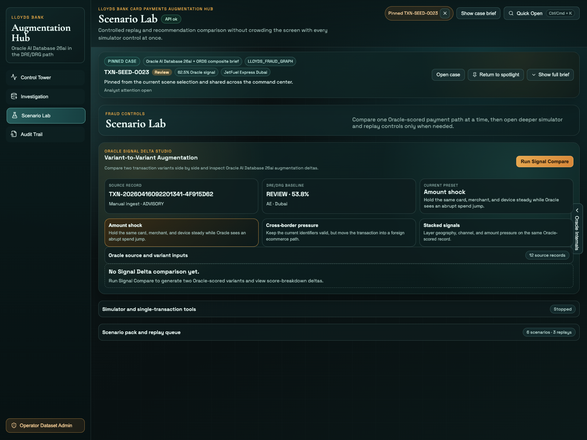
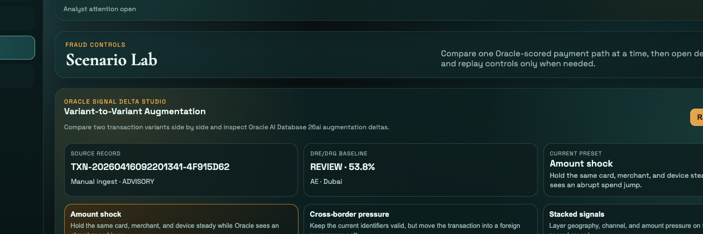

# Scene 3: Scenario Lab

## Introduction

The Scenario Lab is designed as a guided operator workspace. You start with `Oracle Signal Delta Studio`, use the disclosure panels only when you need them, and reopen replayed cases directly from the app.

Estimated Time: 15 minutes

### Objectives

In this lab, you will:
- Open Scenario Lab and identify its primary controls.
- Run a scenario through Oracle and reload it in the replay queue.
- Compare two Oracle-scored variants with `Run Signal Compare`.

## Task 1: Open Scenario Lab and find the primary controls

1. Click `Scenario Lab` in the left navigation.
2. Review the main panel `Oracle Signal Delta Studio`.
3. Note the primary action button `Run Signal Compare`.
4. Confirm the supporting disclosures are available but collapsed until needed:
    - `Simulator and single-transaction tools`
    - `Scenario pack and replay queue`

Expected result:
- Scenario Lab opens with the comparison studio visible first, while the heavier simulator and replay controls stay tucked away until you need them.

## Task 2: Run a scenario and load the replay queue

1. Expand `Scenario pack and replay queue`.
2. In `Scenario Pack`, click `Run in Oracle` on any scenario card.
3. Wait for `Oracle Scenario Output` to appear lower on the page.
4. In `Oracle Replay Queue`, confirm a new replay card appears for the transaction you just generated.
5. On that replay card, click `Pin in Command Deck`.

Expected result:
- The app runs a scenario, shows the output on screen, and adds the new transaction to the replay queue so it can be reopened without rerunning the scenario.

## Task 3: Compare two Oracle-scored variants

1. Return to `Oracle Signal Delta Studio`.
2. In the preset row, click `Amount shock`.
3. Confirm the summary cards now show `Source Record`, `DRE/DRG Baseline`, and `Current Preset`.
4. Click `Run Signal Compare`.
5. Review the results for `Variant A` and `Variant B`, then note these changes on screen:
    - `Score delta`
    - `Recommendation shift`
    - `Reason delta`
6. Expand `Score breakdown delta` to inspect which signal bars increased or dropped between the two variants.
7. Use `Open Investigation` on either result card if you want to continue with that transaction in the Investigation workbench.

Expected result:
- `Run Signal Compare` produces a side-by-side Oracle comparison, and the result cards show exactly how the recommendation path changed between the two variants.

## Task 4: Why this matters?

Scenario Lab lets a user test fraud pressure safely inside the application instead of treating scenario execution as a backend-only demo. The important user experience is that scenarios, replays, and comparison output all stay visible and reusable from one place.

## Credits & Build Notes

- **Author** - The LiveLabs Team
- **Last Updated By/Date** - The LiveLabs Team, April 2026
