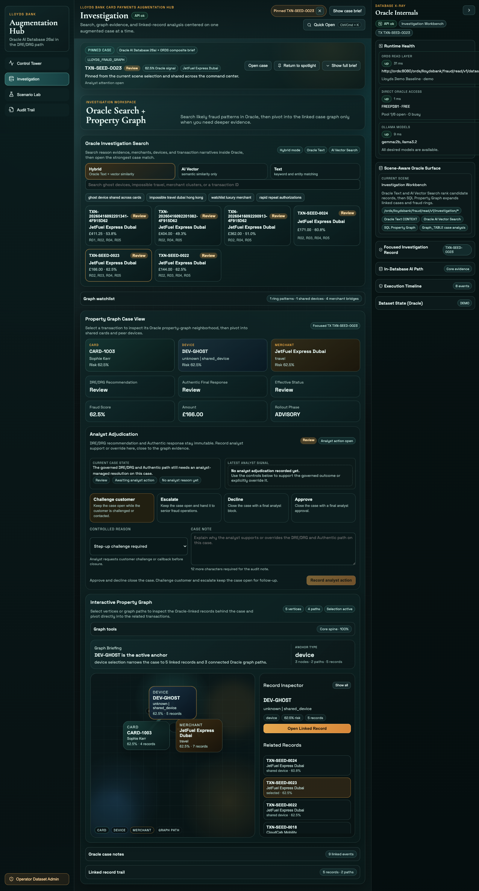
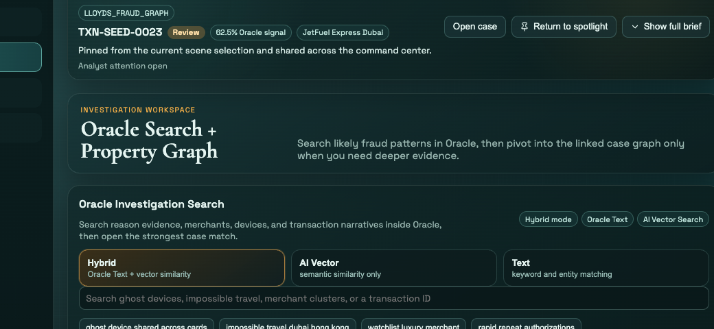
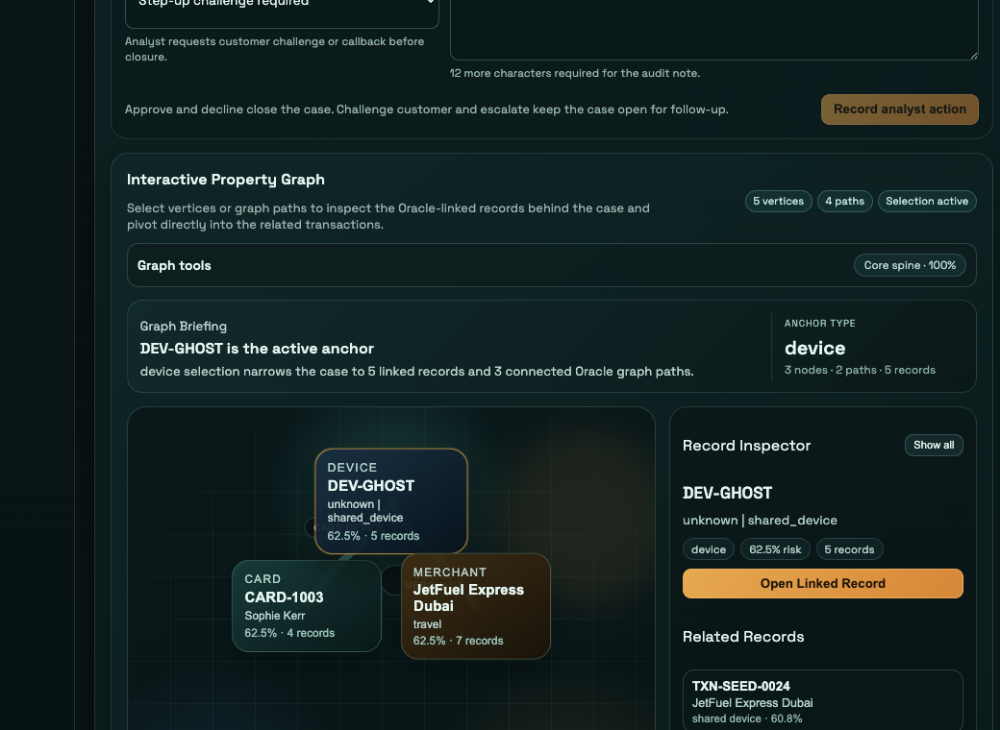

# Scene 4: Investigation Workbench

## Introduction

The Investigation workbench turns search results into a guided case review. You will search from the UI, compare retrieval modes, and then open one case in the property graph so the graph and record inspector react to your clicks.

Estimated Time: 15 minutes

### Objectives

In this lab, you will:
- Search the case corpus from the Investigation screen.
- Compare `Hybrid`, `AI Vector`, and `Text` retrieval modes.
- Open one case in the property graph and inspect the linked records on screen.

## Task 1: Open Investigation and run your first search

1. Click `Investigation` in the left navigation.
2. In `Oracle Investigation Search`, keep `Hybrid` selected.
3. Click the suggestion `ghost device shared across cards`, or type it into the search box yourself.
4. Wait for the result cards to populate.
5. Review the badges above the results and confirm the screen stays anchored around:
    - `Hybrid mode`
    - `Oracle Text`
    - `AI Vector Search`

Expected result:
- The workbench returns ranked search results directly in the UI, and the search area makes it clear which Oracle retrieval path you are using.

## Task 2: Compare the retrieval modes

1. Click `AI Vector`.
2. Review how the result ordering and score chips change.
3. Click `Text` and note the keyword-style result view.
4. Click `Hybrid` to return to the combined ranking mode.
5. Expand `Oracle retrieval details`.
6. Review `Oracle AI Vector Search Capability`, `Oracle Search Engine`, and the `Oracle Text CONTAINS Query` if it is shown.

Expected result:
- The same search can be re-ranked from the UI by changing modes, and the retrieval-details panel explains why the results differ.

## Task 3: Open one case in the property graph

1. Click any search result card.
2. Scroll to `Property Graph Case View`.
3. Confirm the view updates to `Focused TX <transactionId>`.
4. Review the case KPI strip, especially:
    - `DRE/DRG Recommendation`
    - `Authentic Final Response`
    - `Effective Status`
    - `Fraud Score`
5. In the graph canvas, click a node or a graph path.
6. Watch `Record Inspector` fill in and notice `Related Records` or `Path Records` narrows to your current graph selection.
7. Click `Open Linked Record` if you want to shift the case focus to another connected transaction.

Expected result:
- The graph reacts directly to your clicks, and the record inspector gives you a guided path from one selected case to its connected records.

## Task 4: Why this matters?

This screen only feels useful when the user can move naturally from search to graph to linked records without switching tools or guessing what changed. Investigation works because every click updates the case context on screen in a predictable way.

## Acknowledgements

- Oracle LiveLabs contributors and maintainers.

## Credits & Build Notes

- **Author** - The LiveLabs Team
- **Last Updated By/Date** - The LiveLabs Team, April 2026
