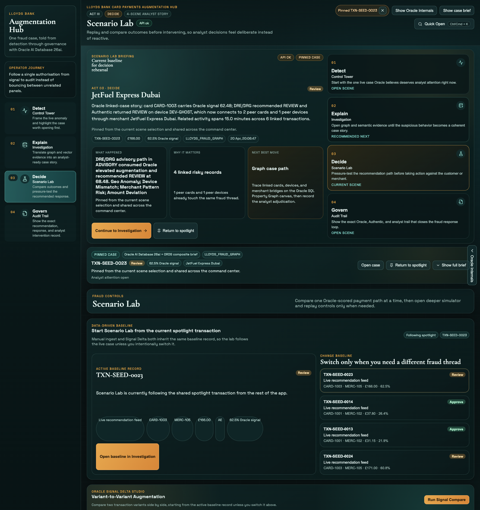
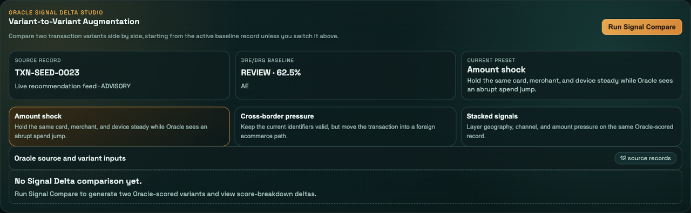

# Scene 4: Scenario Lab

## Introduction

Scenario Lab now behaves like a rehearsal surface for the active case, not a disconnected simulator page. You will start from the current baseline record, change it only when necessary, and compare Oracle-scored variants before deciding how to respond.

Estimated Time: 15 minutes

### Objectives

In this lab, you will:
- Open Scenario Lab and confirm it follows the current spotlight record by default.
- Compare two Oracle-scored variants with `Run Signal Compare`.
- Review the supporting scenario and replay surfaces without losing the main baseline.

## Task 1: Open Scenario Lab and confirm the active baseline

1. Click `Scenario Lab` in the left navigation.
2. In `Active Baseline Record`, confirm the page is following the shared spotlight transaction by default.
3. Review the baseline metadata, including source label, card, merchant, country, and Oracle signal.
4. In `Change Baseline`, note that alternate records are available, but switching is optional.

Expected result:
- Scenario Lab opens on a live Oracle-scored baseline instead of an empty simulator state.

## Task 2: Compare two Oracle-scored variants

1. In `Oracle Signal Delta Studio`, review the three summary cards:
    - `Source Record`
    - `DRE/DRG Baseline`
    - `Current Preset`
2. In the preset row, click `Amount shock`, `Cross-border pressure`, or `Stacked signals`.
3. Click `Run Signal Compare`.
4. Review the results for `Variant A` and `Variant B`, then note these changes on screen:
    - `Score delta`
    - `Recommendation shift`
    - `Reason delta`
5. Expand `Score breakdown delta` to inspect which signal bars increased or dropped between the two variants.
6. Use `Open Investigation` on either result card if you want to continue with that transaction in the Investigation workbench.

Expected result:
- `Run Signal Compare` produces a side-by-side Oracle comparison, and the result cards show exactly how the recommendation path changed between the two variants.

## Task 3: Review the supporting scenario and replay surfaces

1. Expand `Scenario pack and replay queue`.
2. Review the `Scenario Pack` cards and note that curated stories can still be run through Oracle when you need fresh examples.
3. Review `Oracle Replay Queue` and confirm recent scenario or ingest transactions can be reopened without rerunning the workflow.
4. Leave the disclosure collapsed again when you are finished.

Expected result:
- Scenario Lab keeps simulator and replay controls available, but they no longer dominate the main decision-rehearsal flow.

## Task 4: Why this matters?

Scenario Lab should feel like a deliberate decision surface, not a playground that breaks the narrative. By seeding from the live baseline and keeping the heavier tools in supporting disclosures, the page now helps the operator decide before they act.

## Credits & Build Notes

- **Author** - The LiveLabs Team
- **Last Updated By/Date** - The LiveLabs Team, April 2026
