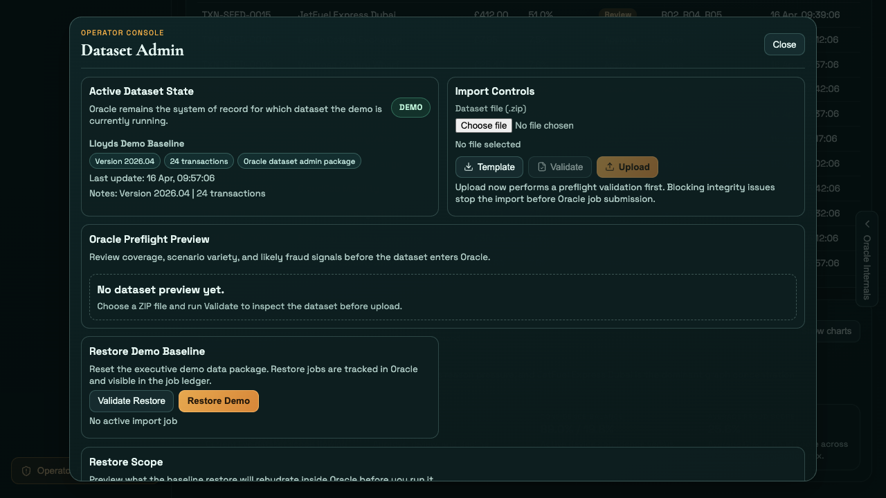
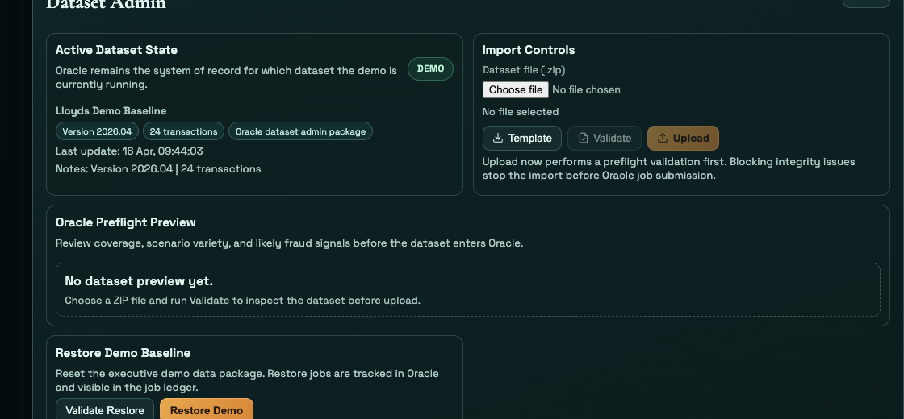
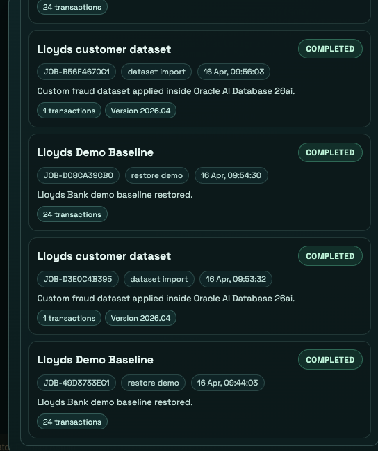
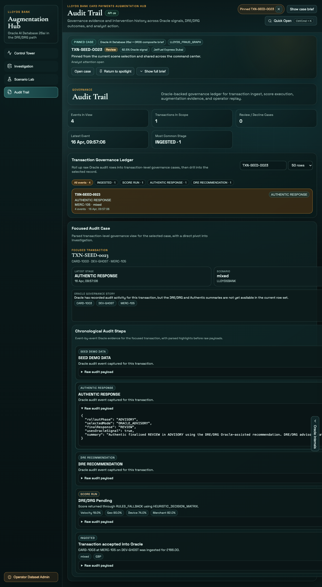
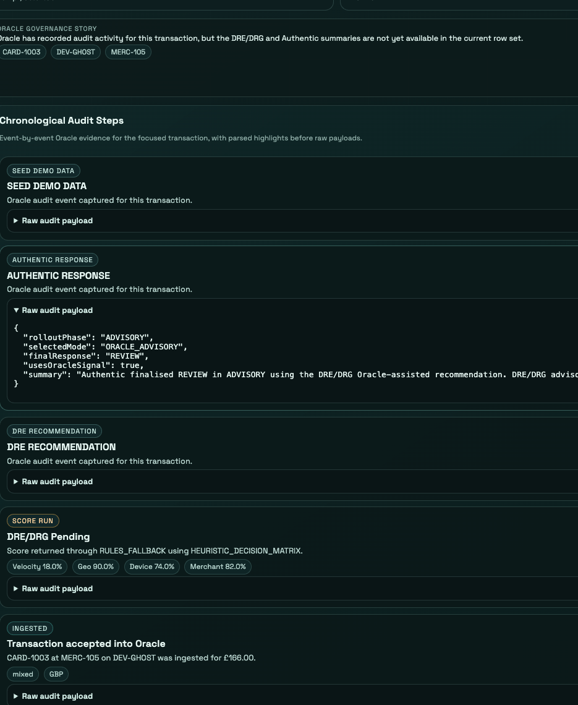

# Scene 5: Dataset Admin & Audit

## Introduction

Scene 5 covers the two governance surfaces that operators use after the core fraud scenes: Dataset Admin and Audit Trail. You will open the dataset overlay directly from the app, then move into Audit Trail to review the same transaction as a governance record with Oracle event history.

Estimated Time: 15 minutes

### Objectives

In this lab, you will:
- Open the Dataset Admin overlay directly from the application shell.
- Validate a dataset package without changing the active dataset.
- Restore the demo baseline and confirm the ledger updates in the UI.
- Review one transaction in Audit Trail and inspect its chronological Oracle event history.

## Task 1: Open Dataset Admin

1. Click `Operator Dataset Admin` in the lower-left rail.
2. Confirm the overlay opens immediately without requiring an operator code.
3. Review the main sections inside the overlay:
    - `Active Dataset State`
    - `Import Controls`
    - `Oracle Preflight Preview`
    - `Restore Demo Baseline`
    - `Restore Scope`
    - `Oracle Job Ledger`

Expected result:
- The overlay opens directly, and the user can see the current dataset status, import controls, restore actions, and recent Oracle jobs in one place.

## Task 2: Validate a dataset package

1. In `Import Controls`, click `Template`.
2. When the ZIP file downloads, choose it with the file picker.
3. Click `Validate`.
4. Watch `Oracle Preflight Preview` fill in with the dataset summary, scenario variety, likely fraud signals, and sample transactions.
5. Confirm `Active Dataset State` does not change after a validate-only run.

Expected result:
- The overlay previews the dataset on screen before anything is imported, so the user can inspect the package without altering the active environment.

## Task 3: Restore the demo baseline and watch the ledger update

1. In `Restore Demo Baseline`, click `Validate Restore`.
2. Review the contents shown in `Restore Scope`.
3. Click `Restore Demo`.
4. Watch the status text and progress bar update while the restore job runs.
5. In `Oracle Job Ledger`, locate the newest row and note the job ID, status, transaction count, and version chips.
6. Return to `Active Dataset State` and confirm it shows `The Demo Baseline`.

Expected result:
- The overlay shows the restore progressing in real time, the ledger records the completed Oracle job, and the active dataset returns to the demo baseline.

## Task 4: Review the Audit Trail for the same case

1. Close the overlay.
2. Click `Audit Trail` in the left navigation.
3. In `Transaction Governance Ledger`, click a transaction row such as `TXN-SEED-0023`.
4. Review the KPI strip at the top of the page, then confirm the selected row drives `Focused Audit Case`.
5. In the focused case, review:
    - `Latest stage`
    - `Scenario`
    - `Disposition`
    - `Amount`
6. Click `Open in Investigation` if you want to pivot the same case back into the graph workbench.
7. Scroll to `Chronological Audit Steps` and expand one `Raw audit payload` section to inspect the recorded event body.

Expected result:
- Audit Trail turns the same transaction into a readable governance record, with ledger filters, a focused-case summary, and raw Oracle event payloads all available from one screen.

## Task 5: Why this matters?

Dataset changes and fraud decisions both need governance, not just runtime flair. Scene 5 proves the app can both manage customer-shaped data safely and replay Oracle-backed audit evidence clearly enough for an operator, reviewer, or stakeholder walkthrough.

## Credits & Build Notes

- **Author** - The LiveLabs Team
- **Last Updated By/Date** - The LiveLabs Team, April 2026
