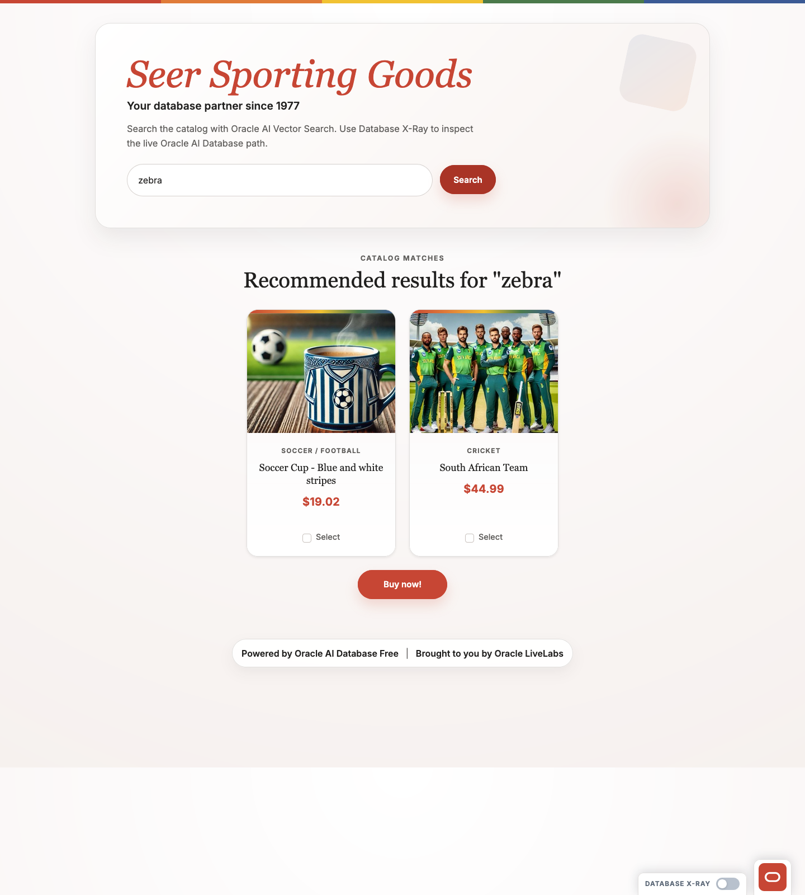
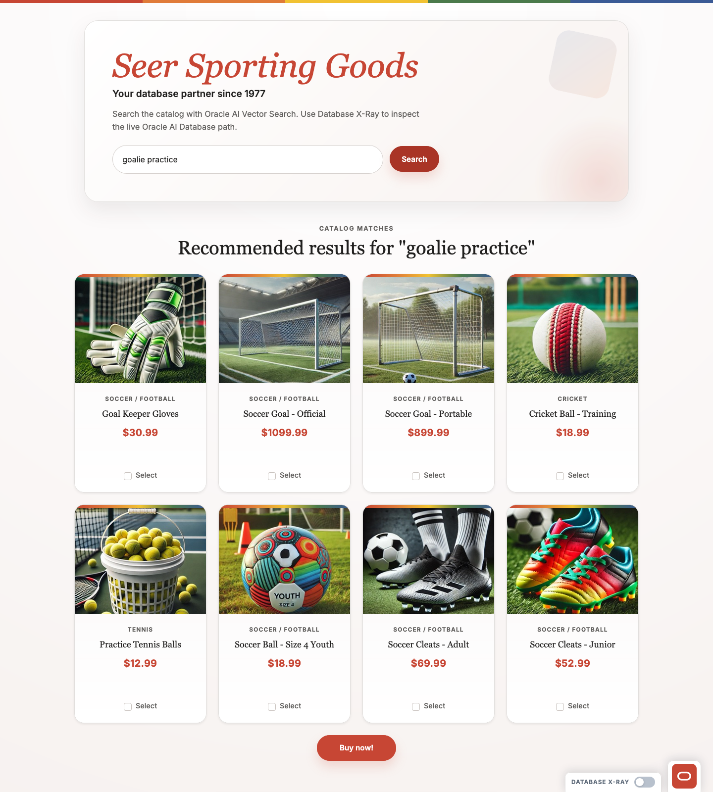

# Scene 1 Semantic Search

## Introduction

This scene lets you experience semantic search directly. You will enter phrases that do not appear as exact product names and observe how the storefront still returns relevant products.

Estimated Time: 12 minutes

### Objectives

In this lab, you will:
- Run two semantic search examples from the storefront.
- Compare abstract shopper phrases to the ranked catalog results.
- Describe what changed between exact-word expectations and semantic retrieval.

## Task 1: Search for `zebra`

1. Open the storefront in a browser:
    ```text
    http://localhost:5500
    ```
2. In the search box, enter `zebra`.
3. Click **Search**.
4. Confirm the storefront returns semantically related products such as a striped soccer cup and the South African cricket team.

    

## Task 2: Search for `goalie practice`

1. Replace the current query with `goalie practice`.
2. Click **Search** again.
3. Confirm the ranked matches include items such as **Goal Keeper Gloves**, soccer goals, and practice-oriented sports gear.

    

## Task 3: Interpret the search results

1. For `zebra`, note that the returned products are related by meaning rather than literal text:
    - the catalog does not need product names that contain the word `zebra`,
    - the app still surfaces meaning-adjacent results such as stripes and South Africa.
2. For `goalie practice`, note how the search expands into a goalkeeper and training scenario:
    - the engine recognizes the activity behind the phrase,
    - the returned products include gloves, goals, and practice items even though the phrase is not an exact catalog label.
3. Summarize the experience in your own words. For example:
    - "I can search by intent instead of exact product names."
    - "The results reflect related concepts, not just literal matches."
    - "That makes the catalog easier to explore when I do not know the precise wording."

## Task 4: Why this matters

As you use the storefront, search feels more forgiving and more useful. You do not need to know the exact catalog vocabulary to find relevant items. Oracle AI Database makes that possible by storing product embeddings in `products_vector`, generating an embedding for your query at runtime, and ranking nearby results with `vector_distance`. The practical takeaway is simple: discovery feels faster and less brittle.

## Learn More

- [Overview of Oracle AI Vector Search](https://docs.oracle.com/en/database/oracle/oracle-database/26/vecse/overview-ai-vector-search.html) for the semantic search behavior you just tested in the storefront.
- [UTL_TO_EMBEDDING and UTL_TO_EMBEDDINGS](https://docs.oracle.com/en/database/oracle/oracle-database/26/vecse/utl_to_embedding-and-utl_to_embeddings-dbms_vector.html) for the in-database embedding generation used in the search flow.
- [VECTOR_DISTANCE](https://docs.oracle.com/en/database/oracle/oracle-database/26/sqlrf/vector_distance.html) for the SQL similarity function used to rank the nearest catalog matches.

## Credits & Build Notes

- **Author** - LiveLabs Team
- **Last Updated By/Date** - LiveLabs Team, March 2026
