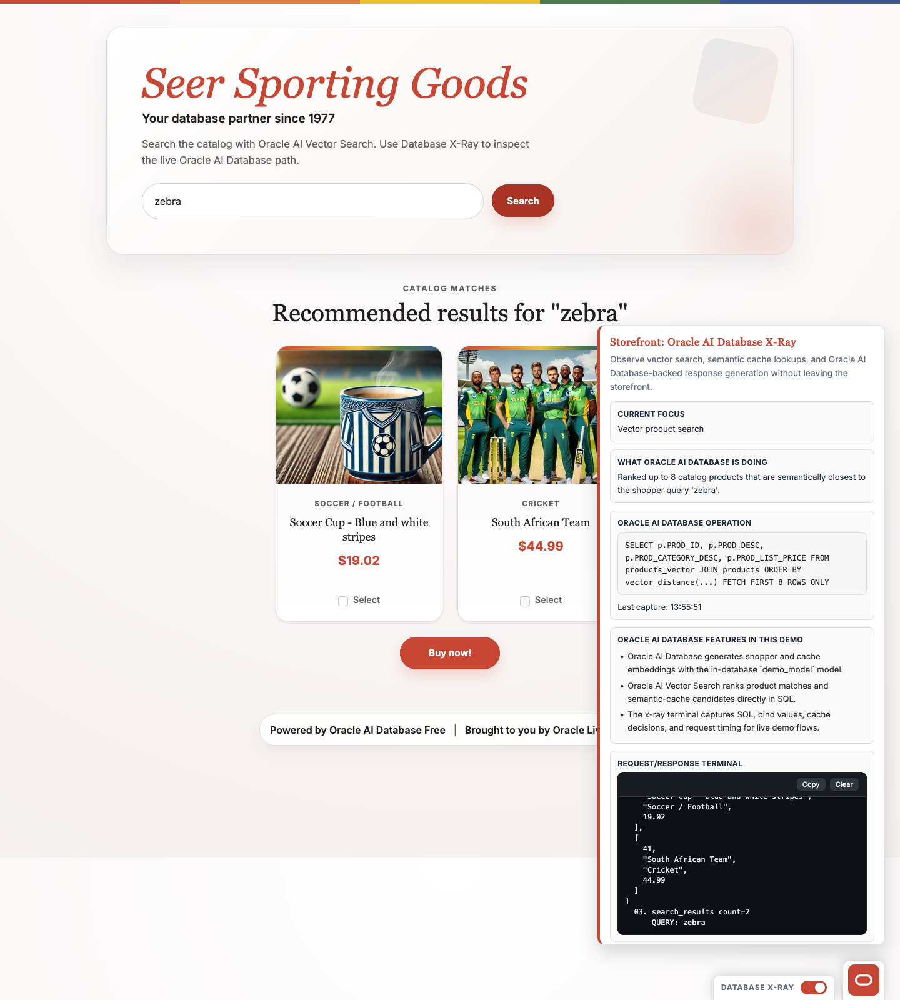

# Scene 2 Database X-Ray

## Introduction

This scene lets you inspect why the results look the way they do. Database X-Ray gives you a visible request path so you can move from "I see the result" to "I understand how it was produced."

Estimated Time: 10 minutes

### Objectives

In this lab, you will:
- Turn on Database X-Ray from the storefront.
- Rerun a semantic search with tracing enabled.
- Connect the X-Ray panel to the SQL and Oracle AI Database behavior behind the result.

## Task 1: Enable Database X-Ray and rerun `zebra`

1. In the bottom-right control dock, turn on **Database X-Ray**.
2. Enter `zebra` in the search box.
3. Click **Search**.
4. Confirm the X-Ray panel opens on the right side of the page and captures the traced search request.

    

## Task 2: Inspect what the X-Ray panel reveals

1. In the X-Ray panel, review the operation section that explains the Oracle AI Database path behind the request.
2. Compare it to the storefront query in `app.py`:
    ```sql
    SELECT p.PROD_ID, p.PROD_DESC, p.PROD_CATEGORY_DESC, p.PROD_LIST_PRICE
    FROM products_vector pv
    JOIN products p ON pv.PROD_ID = p.PROD_ID
    WHERE vector_distance(
        pv.EMBEDDING,
        DBMS_VECTOR_CHAIN.UTL_TO_EMBEDDING(
            :search_value,
            JSON('{"provider":"database", "model":"demo_model"}')
        ),
        COSINE
    ) < 0.7
    ORDER BY vector_distance(
        pv.EMBEDDING,
        DBMS_VECTOR_CHAIN.UTL_TO_EMBEDDING(
            :search_value,
            JSON('{"provider":"database", "model":"demo_model"}')
        ),
        COSINE
    )
    FETCH FIRST 8 ROWS ONLY
    ```
3. Call out the three important behaviors:
    - Oracle AI Database generates the shopper embedding with `DBMS_VECTOR_CHAIN.UTL_TO_EMBEDDING`.
    - `vector_distance(..., COSINE)` ranks the nearest products directly in SQL.
    - the app returns only the top matches needed for the storefront.
4. Summarize what the panel shows you:
    - the request is not a black box,
    - the ranking is grounded in database-resident vectors and SQL,
    - the exact request path is inspectable from the UI.

## Task 3: Read the request/response terminal

1. In the X-Ray terminal, point out the POST request and the shopper query.
2. Highlight the backend trace that shows SQL, bind values, row counts, and preview data.
3. Use this panel to confirm that the LiveStack exposes the database behavior instead of hiding it behind the UI.

## Task 4: Why this matters

When you are exploring the LiveStack on your own, explainability matters. Database X-Ray lets you inspect the embedding generation, SQL ranking, and response trace directly from the UI. That makes the result easier to trust and easier to learn from because you can connect what you saw on screen to the underlying Oracle AI Database behavior.

## Learn More

- [Overview of Oracle AI Vector Search](https://docs.oracle.com/en/database/oracle/oracle-database/26/vecse/overview-ai-vector-search.html) for the database-native semantic retrieval model behind the X-Ray panel.
- [UTL_TO_EMBEDDING and UTL_TO_EMBEDDINGS](https://docs.oracle.com/en/database/oracle/oracle-database/26/vecse/utl_to_embedding-and-utl_to_embeddings-dbms_vector.html) for the embedding call shown in the traced search SQL.
- [VECTOR_DISTANCE](https://docs.oracle.com/en/database/oracle/oracle-database/26/sqlrf/vector_distance.html) for the SQL distance function used in the X-Ray request trace.

## Credits & Build Notes

- **Author** - LiveLabs Team
- **Last Updated By/Date** - LiveLabs Team, March 2026
