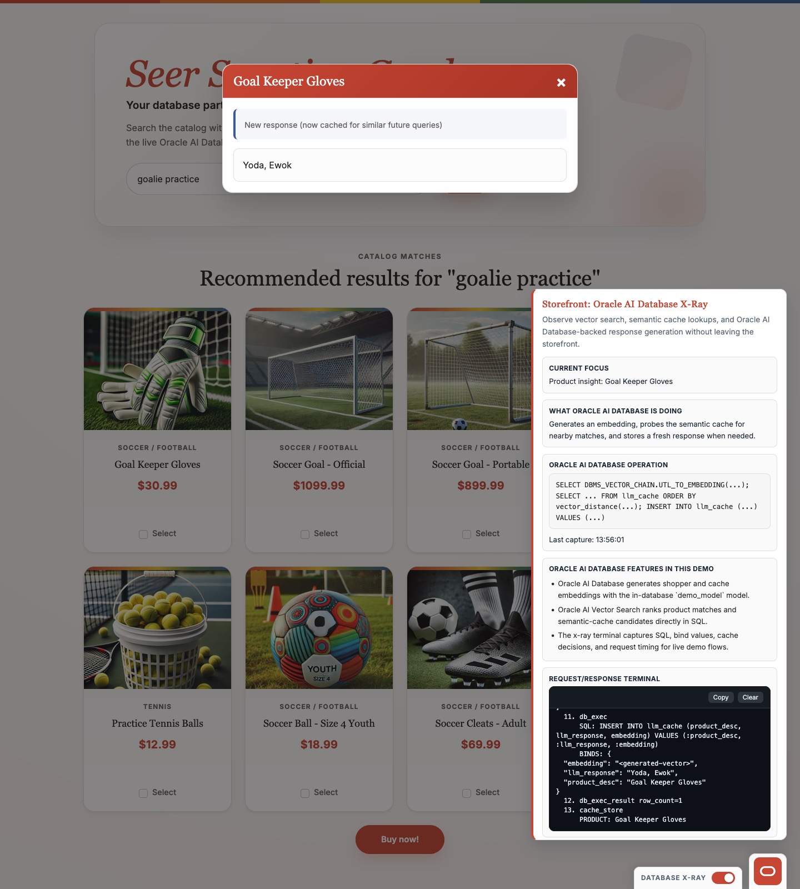

# Scene 3 Semantic Cache

## Introduction

This scene shows what happens when you request the same product insight more than once. You will trigger a fresh response first, then repeat the request and observe how the LiveStack reuses a semantically similar cached answer.

Estimated Time: 12 minutes

### Objectives

In this lab, you will:
- Clear the semantic cache to force a fresh product-insight request.
- Open the same product twice and compare the first request to the second.
- Explain how semantic cache changes responsiveness and reuse.

## Task 1: Clear the semantic cache

1. Open a terminal.
2. Clear the cache table:
    ```bash
    curl -X POST http://localhost:5500/clear_cache
    ```
3. Return to the storefront and make sure **Database X-Ray** is still enabled.
4. Search for `goalie practice`.

    Expected result:
    - The cache table is cleared before the next product-insight request.
    - The next product modal lookup must generate a fresh result before it can be reused.

## Task 2: Trigger a fresh product insight

1. From the `goalie practice` results, click **Goal Keeper Gloves**.
2. Wait for the modal to finish loading.
3. Confirm the modal shows **New response (now cached for similar future queries)** and the X-Ray terminal shows a cache miss followed by an insert into `llm_cache`.

    

## Task 3: Repeat the same request and observe the cache hit

1. Click **Goal Keeper Gloves** again.
2. Confirm the modal now shows **From semantic cache** with a similarity percentage.
3. Review the X-Ray panel and note that the response was reused instead of regenerated.

    

## Task 4: Interpret the cache behavior

1. Review the semantic-cache lookup that powers this flow:
    ```sql
    SELECT cache_id,
           TO_CHAR(product_desc) AS product_desc_str,
           TO_CHAR(llm_response) AS llm_response_str,
           vector_distance(embedding, :input_embedding, COSINE) AS similarity
    FROM llm_cache
    WHERE vector_distance(embedding, :input_embedding, COSINE) < :threshold
    ORDER BY vector_distance(embedding, :input_embedding, COSINE)
    FETCH FIRST 1 ROWS ONLY
    ```
2. Explain the first request in sequence:
    - generate the product embedding,
    - search `llm_cache`,
    - miss the threshold check,
    - call the LLM,
    - insert the new response and embedding.
3. Explain the second request in sequence:
    - generate the same product embedding,
    - find a nearby cache row,
    - return the stored response without another LLM round trip.
4. Summarize the behavior in your own words. For example:
    - "The first request generates and stores a new answer."
    - "The second request reuses a close semantic match instead of regenerating."
    - "That makes repeated lookups feel faster without changing the overall experience."

## Task 5: Why this matters

As you use the LiveStack, repeated product-insight requests become more efficient because the app can reuse semantically similar answers instead of calling the LLM every time. Oracle AI Database powers this with embeddings and `vector_distance`, so the same vector workflow supports both retrieval and reuse. The result is a faster, more consistent experience on repeated lookups.

## Learn More

- [DBMS_VECTOR_CHAIN](https://docs.oracle.com/en/database/oracle/oracle-database/26/vecse/dbms_vector_chain-vecse.html) for the Oracle AI Database package used to build embedding-driven flows.
- [UTL_TO_EMBEDDING and UTL_TO_EMBEDDINGS](https://docs.oracle.com/en/database/oracle/oracle-database/26/vecse/utl_to_embedding-and-utl_to_embeddings-dbms_vector.html) for the embedding generation step that happens before each cache lookup.
- [VECTOR_DISTANCE](https://docs.oracle.com/en/database/oracle/oracle-database/26/sqlrf/vector_distance.html) for the similarity threshold and ranking logic used to decide cache hits.

## Credits & Build Notes

- **Author** - LiveLabs Team
- **Last Updated By/Date** - LiveLabs Team, March 2026
