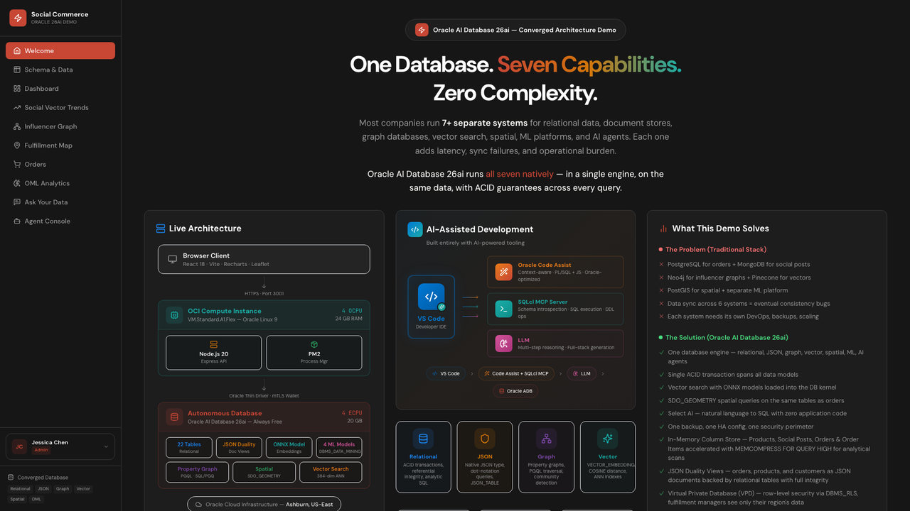

# Converged Social Commerce LiveStack

## Introduction

This workshop walks the current Social Commerce application running from the local `stack/` folder. The stack is launched from one `compose.yml` file and runs Oracle Database Free, ORDS, Ollama, and the original Node/Express plus Vite application.

You will move through the full scene flow exposed by the application navigation: Welcome, Schema and Data, Dashboard, Social Vector Trends, Influencer Graph, Fulfillment Map, Orders, OML Analytics, Ask Your Data, and Agent Console.

Estimated Workshop Time: 1 hour 40 minutes

> Note: This workshop treats `stack/compose.yml`, `stack/.env`, and the live app behavior as source of truth.

### Objectives

In this workshop, you will:
- Navigate every major scene in the running application.
- Connect each scene to the underlying Oracle capabilities shown in the Oracle Internals panel.
- Exercise vector search, graph traversal, spatial fulfillment, JSON duality views, and OML analytics.
- Use Ask Your Data and Agent Console against the stack's local Ollama runtime.
- Run and validate the full stack locally with Podman Compose.

### Prerequisites

This workshop assumes you have:
- A running stack endpoint, or local access to run `podman compose`.
- Browser access to `http://localhost:5500`.
- Terminal access for service verification commands.

## Workshop Flow

- Scene 1: Welcome and Navigation
- Scene 2: Schema and Data
- Scene 3: Dashboard and Product Details
- Scene 4: Social Vector Trends
- Scene 5: Influencer Graph
- Scene 6: Fulfillment Map
- Scene 7: Orders
- Scene 8: OML Analytics
- Scene 9: Ask Your Data
- Scene 10: Agent Console
- Run the LiveStack locally with Podman Compose
- Conclusion and key takeaways

## Quick Reference

- UI URL (default): `http://localhost:5500`
- API health URL (default): `http://localhost:5500/api/health`
- ORDS URL (default): `http://localhost:8181/ords/`
- Ollama tags URL (default): `http://localhost:11434/api/tags`
- Database service (default): `localhost:1521/FREEPDB1`
- Application schema: `SOCIALCOMMERCE`
- Primary Ollama model: `llama3.2`
- Secondary Ollama model: `gemma:2b`

## Learn More

- [Oracle Database documentation](https://docs.oracle.com/en/database/oracle/oracle-database/)
- [Overview of Oracle AI Vector Search](https://docs.oracle.com/en/database/oracle/oracle-database/26/vecse/overview-ai-vector-search.html)
- [Oracle REST Data Services](https://docs.oracle.com/en/database/oracle/oracle-database/26/rest-data-services/index.html)

## Acknowledgements

- Oracle LiveLabs contributors and maintainers.

## Credits & Build Notes

- **Author** - LiveLabs Team
- **Last Updated By/Date** - LiveLabs Team, April 2026
