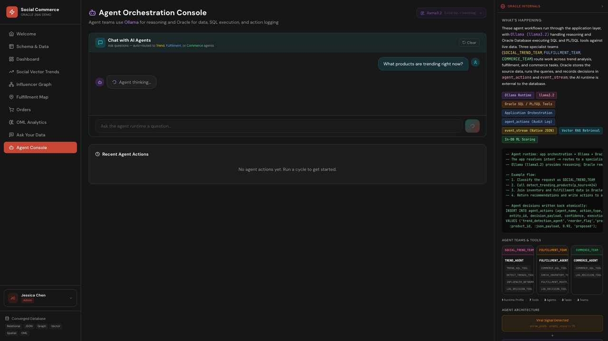

# Scene 10: Agent Console

## Introduction

This scene demonstrates routed agent interactions across trend, fulfillment, and commerce intents, with tool usage and response context returned in one console.

Estimated Time: 12 minutes

### Objectives

In this lab, you will:
- Run an agent prompt for trend analysis.
- Run an agent prompt for fulfillment or commerce.
- Inspect routing and tool usage context in responses.

## Task 1: Run a trend-oriented agent request

1. Open `Agent Console`.
2. Submit:
    ```text
    What products are trending right now?
    ```
3. Review response text and metadata badges.

    

Expected result:
- The console returns a trend-focused response with routed context.

## Task 2: Run a fulfillment-oriented request

1. Submit:
    ```text
    Check inventory for Neon Grid Hoodie
    ```
2. Review returned details and any tool or route information shown.

Expected result:
- The response includes fulfillment-oriented reasoning and supporting context.

## Task 3: Review routing and runtime status

1. Note response markers such as routed mode and team context.
2. Optional service check:
    ```bash
    curl -s http://localhost:11434/api/tags | python3 -m json.tool
    ```
3. Confirm local models include `llama3.2` and `gemma:2b`.

Expected result:
- You can verify agent interactions are backed by the local runtime services.

## Task 4: Why this matters?

Agent workflows fail in production when intent routing, data access, and runtime transparency are disconnected. This scene shows a practical pattern where operators can evaluate agent output quality, see routing behavior, and keep decisions tied to real system context.

## Credits & Build Notes

- **Author** - LiveLabs Team
- **Last Updated By/Date** - LiveLabs Team, April 2026
