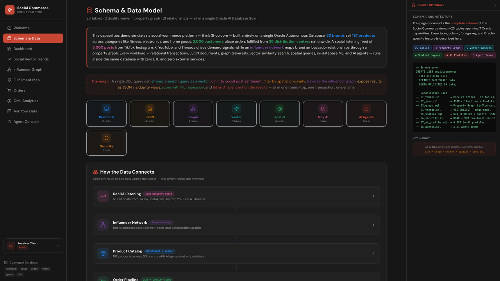

# Scene 2: Schema & Data

## Introduction

This scene is the structural map for the rest of the workshop. It shows how relational, JSON, graph, vector, spatial, security, and OML concepts are represented in one schema.

Estimated Time: 10 minutes

### Objectives

In this lab, you will:
- Inspect capability groupings in the schema scene.
- Map key objects to later scenes.
- Cross-check schema/bootstrap assets in the stack.

## Task 1: Open Schema & Data

1. Click `Schema & Data`.
2. Review grouped object and capability sections.
3. Read one SQL example shown in the scene.

    

Expected result:
- You can identify the main data domains and capability groupings.

## Task 2: Trace key entities

1. Focus on representative entities:
    - `PRODUCTS`, `INVENTORY`
    - `SOCIAL_POSTS`, `INFLUENCERS`
    - `ORDERS`, `ORDER_ITEMS`
    - `FULFILLMENT_CENTERS`, `DEMAND_REGIONS`
2. Note where each entity appears in later scenes.

Expected result:
- You can connect table/entity names to scene-level workflows.

## Task 3: Verify bootstrap source

1. From `stack/`, run:
    ```bash
    ls db/schema
    ```
2. Confirm schema families for core model, vector, graph, spatial, security, and agent helpers are present.

Expected result:
- UI explanations align with bootstrap SQL assets in the repository.

## Task 4: Why this matters?

Without a shared schema map, teams often misdiagnose scene behavior as frontend issues. This scene anchors all later analysis to concrete Oracle objects and capabilities so operational troubleshooting starts from data reality instead of UI assumptions.

## Credits & Build Notes

- **Author** - LiveLabs Team
- **Last Updated By/Date** - LiveLabs Team, April 2026
