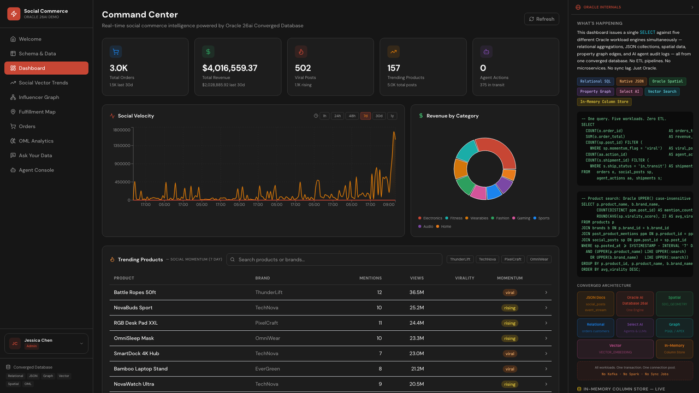
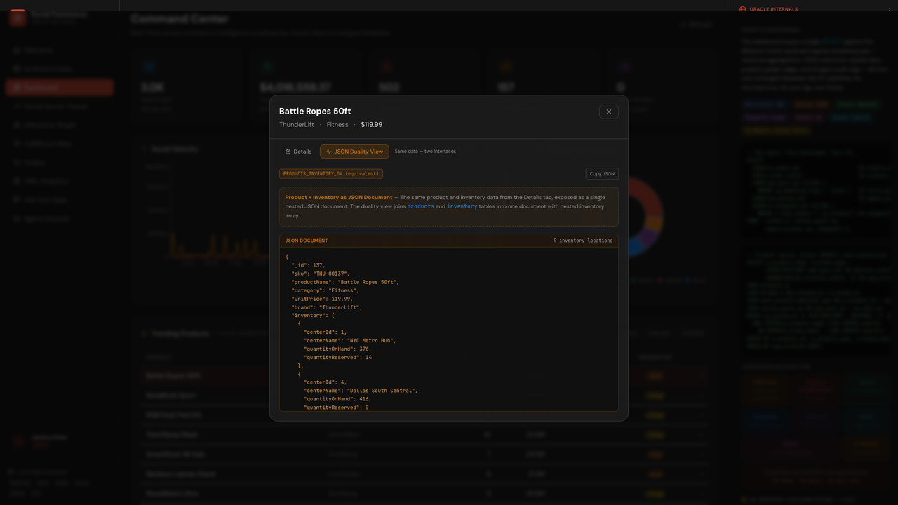

# Scene 3: Dashboard & Product Details

## Introduction

Dashboard is the primary operational scene for KPI monitoring, trend context, and product drilldown with JSON duality comparison.

Estimated Time: 12 minutes

### Objectives

In this lab, you will:
- Review KPI and trend surfaces in Dashboard.
- Open a product drilldown modal.
- Compare relational and JSON duality representations.

## Task 1: Review dashboard KPIs

1. Open `Dashboard`.
2. Review KPI cards and chart sections.
3. Confirm data renders across the page.

    

Expected result:
- Dashboard displays populated business and operational indicators.

## Task 2: Open product details

1. Select a product from a dashboard list or trend section.
2. Open the product detail modal.
3. Inspect inventory and social context in the detail panel.

Expected result:
- Product drilldown shows multi-domain context in one modal workflow.

## Task 3: Compare JSON duality view

1. In the same modal, switch to `JSON Duality View`.
2. Compare values against the relational detail view.

    

Expected result:
- You can validate the same business context through both interfaces.

## Task 4: Why this matters?

Operations teams need one decision surface that blends KPIs, context, and drilldown without context switching across tools. This scene demonstrates how converged data access reduces analysis lag and helps teams move from metrics to action quickly.

## Credits & Build Notes

- **Author** - LiveLabs Team
- **Last Updated By/Date** - LiveLabs Team, April 2026
