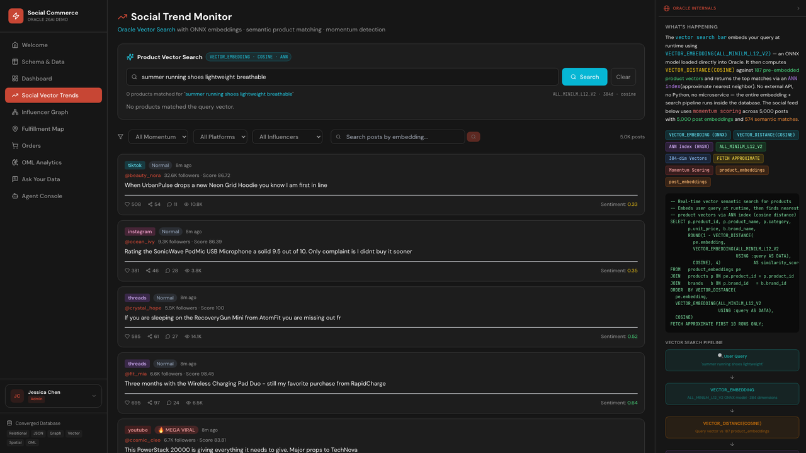
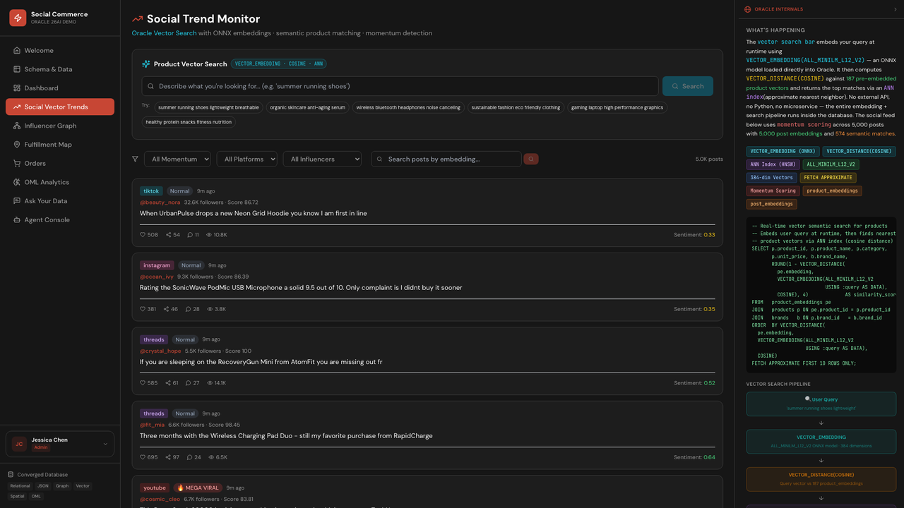

# Scene 4: Social Vector Trends

## Introduction

This scene demonstrates semantic retrieval for products and posts using Oracle vector functions in the running stack.

Estimated Time: 12 minutes

### Objectives

In this lab, you will:
- Run semantic product search.
- Refine social feed context with filters.
- Execute post semantic matching.

## Task 1: Run semantic product search

1. Open `Social Vector Trends`.
2. Submit a natural-language query:
    ```text
    lightweight breathable running gear for summer
    ```
3. Review ranked product results.

    

Expected result:
- Product results are ranked by semantic intent.

## Task 2: Refine social feed context

1. Apply social feed filters such as momentum, platform, and influencer.
2. Observe how feed results update as filters change.

    

Expected result:
- Feed content responds to filter changes and preserves trend context.

## Task 3: Run post semantic search

1. Use post embedding search controls in the same scene.
2. Submit:
    ```text
    viral fitness accessories with high engagement
    ```
3. Review returned post matches.

Expected result:
- Post matches reflect semantic relevance, not simple keyword matching.

## Task 4: Why this matters?

Traditional trend monitoring often loses signal when language varies across platforms. Semantic retrieval closes that gap by matching intent, which helps merchandising and operations teams identify demand shifts earlier and react before stock or fulfillment pressure spikes.

## Credits & Build Notes

- **Author** - LiveLabs Team
- **Last Updated By/Date** - LiveLabs Team, April 2026
