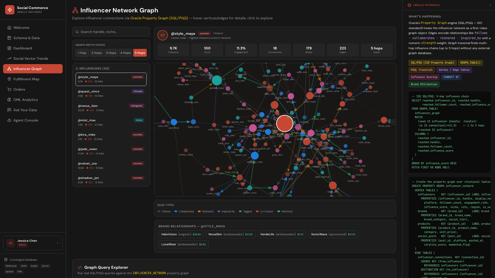

# Scene 5: Influencer Graph

## Introduction

This scene explores influencer connectivity and propagation using Oracle property graph and SQL/PGQ query paths surfaced in the app.

Estimated Time: 10 minutes

### Objectives

In this lab, you will:
- Explore an influencer network graph interactively.
- Run one predefined graph query.
- Inspect graph-specific Oracle Internals context.

## Task 1: Explore the network view

1. Open `Influencer Graph`.
2. Select an influencer from the left-side list.
3. Adjust depth and inspect node and edge changes.
4. Click a node to view details.

    

Expected result:
- Network topology updates interactively based on selected influencer and depth.

## Task 2: Run a graph query example

1. Open the query examples section in the same scene.
2. Run one query example.
3. Review result rows and summary metrics.

Expected result:
- Query output reflects real graph traversal results for the selected pattern.

## Task 3: Validate graph implementation references

1. Optional source check:
    ```bash
    rg -n "GRAPH_TABLE|influencer_network" stack/backend/routes/graph.js
    ```
2. Compare source terms with Oracle Internals annotations in the scene.

Expected result:
- UI behavior aligns with SQL/PGQ-backed graph implementation.

## Task 4: Why this matters?

Influence is a network effect, not a flat metric. Graph-native traversal makes it possible to identify bridge influencers and propagation paths that simple ranking cannot expose, helping teams prioritize high-leverage outreach and campaign spend.

## Credits & Build Notes

- **Author** - LiveLabs Team
- **Last Updated By/Date** - LiveLabs Team, April 2026
