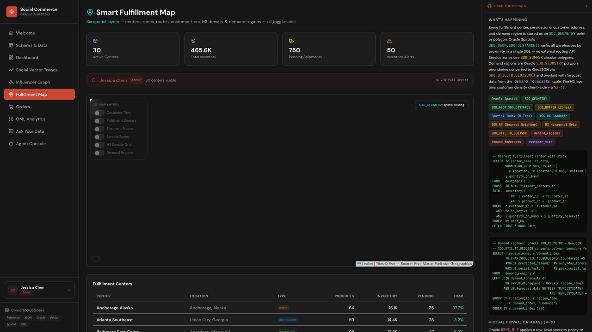

# Scene 6: Fulfillment Map

## Introduction

This scene visualizes fulfillment centers, shipment context, service zones, and demand regions on one interactive spatial map.

Estimated Time: 10 minutes

### Objectives

In this lab, you will:
- Explore the fulfillment map layers.
- Inspect center and demand region metadata.
- Read spatial-focused Oracle Internals context.

## Task 1: Open Fulfillment Map

1. Navigate to `Fulfillment Map`.
2. Confirm the base map and core overlays render.
3. Use zoom and pan to inspect different regions.

    

Expected result:
- The scene loads with fulfillment and demand context visible on the map.

## Task 2: Toggle map layers

1. Toggle layer controls such as:
    - fulfillment centers
    - routes
    - service zones
    - demand regions
2. Observe how each layer changes the map.

Expected result:
- Layer toggles reveal distinct operational and demand dimensions.

## Task 3: Inspect operational metadata

1. Hover or click one fulfillment center.
2. Hover or click one demand region polygon.
3. Note stock, region, and demand-related values shown.

Expected result:
- You can inspect practical logistics data directly in map interactions.

## Task 4: Why this matters?

Fulfillment performance depends on geography as much as inventory. A spatial-first scene helps teams spot routing risk, center pressure, and demand concentration early, improving delivery outcomes and reducing avoidable shipping cost.

## Credits & Build Notes

- **Author** - LiveLabs Team
- **Last Updated By/Date** - LiveLabs Team, April 2026
