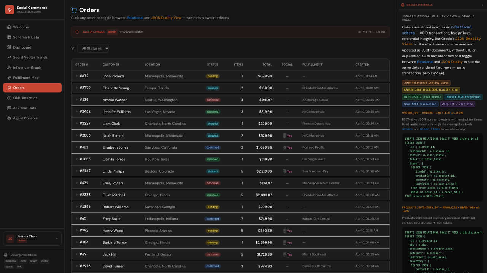
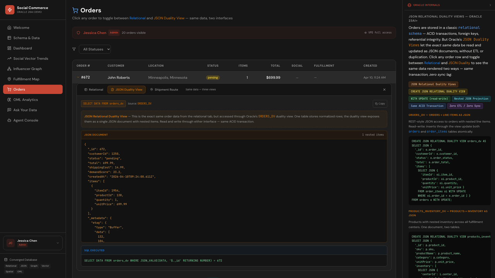

# Scene 7: Orders

## Introduction

This scene focuses on order operations, status filtering, order drilldown, JSON duality access, and shipment route context for individual orders.

Estimated Time: 12 minutes

### Objectives

In this lab, you will:
- Filter and inspect order records.
- Compare relational and JSON duality order views.
- Review route context for one order.

## Task 1: Review order table and filters

1. Open `Orders`.
2. Apply at least one order status filter.
3. Confirm row counts and table entries update.

    

Expected result:
- The order table reflects filtered operational data.

## Task 2: Drill into one order

1. Expand one order row.
2. Review the `Relational` tab content.
3. Capture key fields to compare with JSON duality.

Expected result:
- Detailed order context is available from the expanded panel.

## Task 3: Compare JSON duality and shipment route tabs

1. Switch to `JSON Duality View`.
2. Compare shared fields with the relational tab.
3. Switch to `Shipment Route` and inspect route visualization.

    

Expected result:
- You can inspect one order through relational, JSON, and routing perspectives.

## Task 4: Why this matters?

Order operations often break when transactional detail, document workflows, and route context live in separate systems. This scene demonstrates a converged pattern where teams can troubleshoot and act without cross-system handoffs.

## Credits & Build Notes

- **Author** - LiveLabs Team
- **Last Updated By/Date** - LiveLabs Team, April 2026
