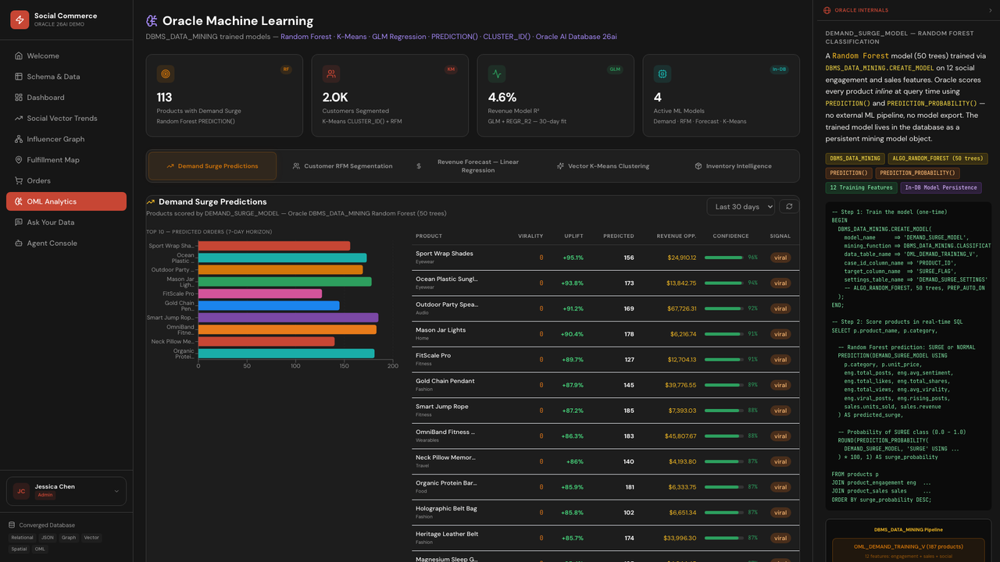

# Scene 8: OML Analytics

## Introduction

This scene presents in-database machine learning workflows for demand, segmentation, revenue forecast, clustering, and inventory intelligence.

Estimated Time: 12 minutes

### Objectives

In this lab, you will:
- Navigate every OML analytics tab.
- Interpret model outputs for operational decisions.
- Connect scene outputs to Oracle Internals explanations.

## Task 1: Open OML Analytics and review tabs

1. Open `OML Analytics`.
2. Confirm tabs for demand, RFM segmentation, forecast, clustering, and inventory are available.

    

Expected result:
- All OML analysis surfaces are visible and selectable.

## Task 2: Inspect demand and segmentation outputs

1. Review `Demand Surge Predictions`.
2. Review `Customer RFM Segmentation`.
3. Identify one high-signal metric from each tab.

Expected result:
- You can identify actionable demand and customer-segment indicators.

## Task 3: Inspect forecast and inventory outputs

1. Review `Revenue Forecast` and `Inventory Intelligence`.
2. Note one projected risk and one mitigation action.

Expected result:
- You can interpret forecast and inventory outputs in operational terms.

## Task 4: Why this matters?

Analytics only creates value when model output is close to live operations. This scene keeps model interpretation near the same data and workflow surfaces used by operators, reducing latency between insight, decision, and execution.

## Credits & Build Notes

- **Author** - LiveLabs Team
- **Last Updated By/Date** - LiveLabs Team, April 2026
