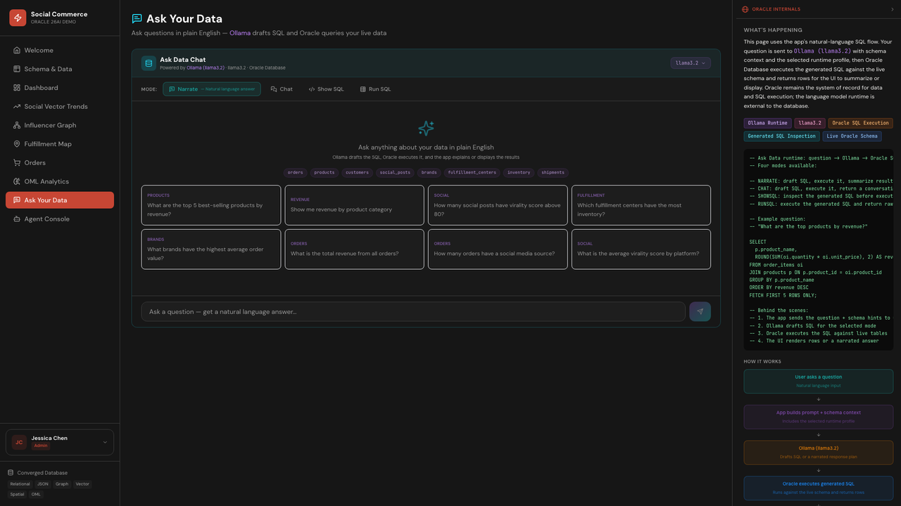

# Scene 9: Ask Your Data

## Introduction

This scene lets users ask natural-language questions, inspect generated SQL, and run read-only query workflows against the live schema through the app runtime.

Estimated Time: 10 minutes

### Objectives

In this lab, you will:
- Use Ask Your Data in multiple interaction modes.
- Inspect generated SQL output.
- Validate live query results against scene context.

## Task 1: Open Ask Your Data and submit a question

1. Open `Ask Your Data`.
2. Keep mode as `Narrate` and submit:
    ```text
    What are the top 5 best-selling products by revenue?
    ```
3. Review the returned answer and metadata.

    

Expected result:
- The scene returns a narrated result grounded in live query output.

## Task 2: Inspect SQL generation

1. Switch mode to `Show SQL`.
2. Submit the same question.
3. Review generated SQL for schema/table alignment.

Expected result:
- You can inspect SQL generated for the same business question.

## Task 3: Execute read-only SQL mode

1. Switch mode to `Run SQL`.
2. Submit:
    ```text
    Show me revenue by product category
    ```
3. Review result rows and compare with expected business context.

Expected result:
- Scene returns row-level results for a read-only query path.

## Task 4: Why this matters?

Natural-language querying is only useful when teams can inspect and trust generated SQL. This scene balances speed and control by keeping Oracle SQL execution transparent, which supports safer adoption in analyst and operations workflows.

## Credits & Build Notes

- **Author** - LiveLabs Team
- **Last Updated By/Date** - LiveLabs Team, April 2026
